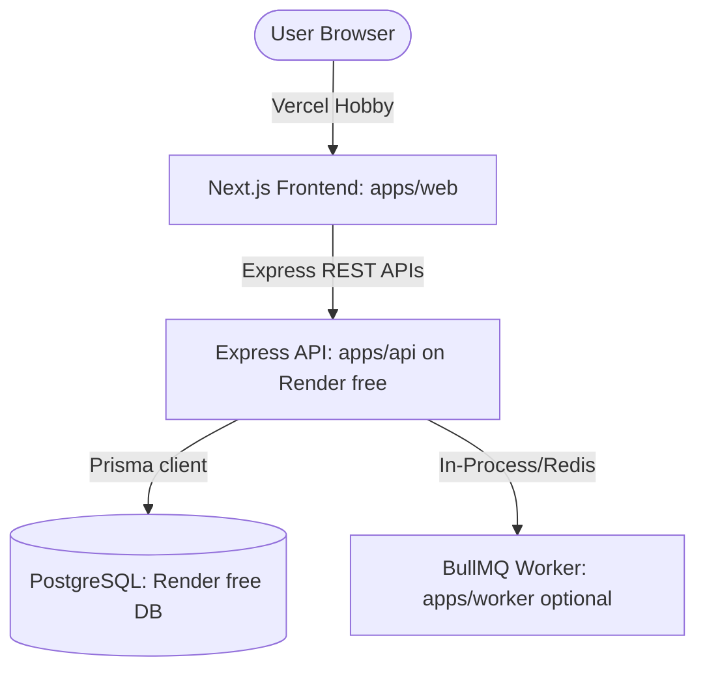

# Free-First Architecture & Demo Deployment Strategy — EcoTransit

EcoTransit is designed to run in a **Free-First** configuration. No paid third-party APIs (Google Maps, Google Routes, Google Vision OCR, Firebase Storage, GCS) or billing accounts are required to run, test, or deploy the application for local development or public presentation (Vercel/Render free tiers). 

---

## 1. Architectural Decisions

1. **Strict Interface Boundaries**: All external dependencies are defined as interfaces (Adapters). 
2. **Optional Paid Providers**: The Google and Firebase integrations are secondary adapters. By default, the application runs on local/mock/free_demo adapters.
3. **Build & Test Isolation**: Build steps, unit tests, and integration tests must run cleanly without checking for Google environment keys.
4. **Resiliency to Missing Keys**: If third-party keys are missing, the system warns the console but initializes fallbacks without crashing `/healthz` or `/readyz`.

---

## 2. Environment Configuration

### Environmental Modes
We define the following modes using environment variables:

| Variable | Mode | Purpose |
|---|---|---|
| `APP_MODE` | `local` | Local development mode |
| | `test` | Automated test environment |
| | `demo` | Public free-tier demo deployment |
| `PROVIDER_MODE` | `local` | (Default) Uses local seed data, database queues, and local assets |
| | `mock` | Mock responses for automated testing |
| | `free_demo` | Optimization for Render/Vercel free-tier deployment |
| | `google` | Optional production mode (requires Google billing/keys) |

### Fallback Providers
When `PROVIDER_MODE` is `local` or `free_demo`:
- **Map**: Uses **Leaflet.js** with OpenStreetMap tiles. Note that Leaflet/OSM is a public utility and tiles must include proper copyright attribution (*"© OpenStreetMap contributors"*). If tiles fail to load or are slow, the UI must fallback to displaying a static map placeholder or allow full functionality using the textual route list. A map rendering failure must not crash or block the application.
- **Route Planning**: Local graph-routing engine calculated using seeded `RouteLine`, `RouteStop`, and `RouteEdge` records via a Dijkstra/BFS traversal on local PostgreSQL data instead of Google Routes API.
- **Places/POI**: Reads station POIs directly from the PostgreSQL seed database.
- **Weather**: Mặc định sử dụng **Weather Presets** nội bộ (`normal`, `rain`, `hot`, `night`). Một adapter thời tiết kết nối API Open-Meteo miễn phí sẽ có sẵn nhưng là tùy chọn (bật/tắt qua ENV). Sự cố gọi API thời tiết bên ngoài hoặc quá giới hạn rate limit tuyệt đối không được làm ảnh hưởng đến build, test hay làm gián đoạn trải nghiệm người dùng trên demo.
- **OCR**: Uses local lightweight regex-based text parsing or a mock verifier that scans the ticket details, with a fallback to a Moderator manual review page.
- **Storage**: Ephemeral local disk storage for dev. For demo, tickets will store a resized/compressed Base64 thumbnail in the database (tối đa 300-500KB), avoiding full-size uploads. Uploads must validate type and size limit before converting.
- **Notifications**: Internal database table notifications.

---

## 3. Free-Tier Constraints & Mitigations

### 1. Render Free Cold Starts
- **Problem**: Render Web Services spin down after 15 minutes of inactivity. When a user visits the Vercel app, the first backend request will experience a 50+ second delay.
- **Mitigation**: 
  - The Next.js frontend UI will display a prominent, friendly loader: *"Hệ thống máy chủ đang khởi động (Render free tier - có thể mất 1-2 phút). Vui lòng đợi trong giây lát..."*.
  - A retry mechanism will automatically ping the `/healthz` API in the background.

### 2. Cross-Origin Auth Cookies (Vercel & Render)
- **Problem**: When Next.js frontend is deployed on Vercel (`ecotransit-web.vercel.app`) and backend is on Render (`ecotransit-api.onrender.com`), direct cross-origin session storage via cookies can be blocked by browsers.
- **Mitigation**:
  - **Option 1 (Preferred)**: Configure Vercel rewrites in `vercel.json` to proxy `/api/:path*` to the Render API endpoint, keeping requests on the same origin (`ecotransit-web.vercel.app/api/*`).
  - **Option 2 (Fallback)**: If direct cross-origin is used, the backend session cookie must be configured with `Secure; HttpOnly; SameSite=None` and CORS must specify `credentials: true` (both on the Express CORS middleware and in client fetch requests via `credentials: 'include'`).
  - **No local token fallback**: Do not fall back to storing auth tokens in `localStorage`. Session cookies are the sole authentication authority.

### 3. Ephemeral Storage & Base64 Ticket Fallback
- **Problem**: Render filesystem is ephemeral; uploaded ticket images are lost when the service restarts.
- **Mitigation**: 
  - The application restricts file size (validate type and size <= 2MB) and converts the upload to a compressed/resized image (max size 300-500KB) saved in a Base64 database column (`base64DataFallback`).
  - Ticket images/thumbnails are private and are only shown inside the authenticated User Wallet and Moderator ticket review dashboard. They are never rendered or public in shareable Time Bill pages.

### 4. Optional Redis & BullMQ
- **Problem**: Render free-tier does not include Redis. A separate worker container might sleep or incur costs.
- **Mitigation**: 
  - If Redis is disabled (`REDIS_ENABLED=false`), `apps/api` runs OCR verification **synchronously** in-process or inserts jobs into a database-backed `Jobs` table which is polled inside the API process. 
  - `/readyz` will check Redis *only* if `REDIS_ENABLED` is `true`.

### 5. Database Setup (Neon PostgreSQL)
- **Problem**: Local database setups like Docker can be complex on Windows, and free-tier databases can delete data or expire.
- **Mitigation**:
  - We use **Neon PostgreSQL** on AWS Singapore, which provides free database branches with integrated connection pooling.
  - Configuration uses two variables: `DATABASE_URL` for pooled queries (using `-pooler` host) and `DIRECT_URL` for migration scripts (without `-pooler` host).
  - The db:push and demo:reset scripts target the Neon branch directly, allowing local development and testing to run completely no-Docker.
  - Re-seeding commands are fully supported:
    - `npm run db:push` (applies the schema structure to Neon)
    - `npm run demo:seed` (seeds rich presentation datasets onto Neon)
    - `npm run demo:reset` (cleans the Neon database and runs seed)

---

## 4. Route Graph Schema
To support local routing calculation in Batch 01 without Google Routes, the PostgreSQL database must include schema structures representing the transit map network:
* **`RouteLine`**: Represents a transport line (e.g. "Metro Tuyến 1", "Tuyến Xe Buýt 19"). Fields: `id`, `name`, `code`, `mode` (metro, bus, walk), `fareBase`, `color`, `active`.
* **`RouteStop`**: Connects stations or stops to a line at a specific order index. Fields: `id`, `lineId`, `stationId`, `orderIndex`.
* **`RouteEdge`**: Represents routing edges for the graph pathfinder. Fields: `id`, `fromStationId`, `toStationId`, `mode` (metro, bus, walk), `distanceMeters`, `durationMinutes`, `fareEstimate`, `active`.

---

## 5. Rich Presentation Seed Data
The database reset/seed commands must prepare a comprehensive presentation state with:
1. **Accounts**: Admin (`admin@ecotransit.vn`), Moderator (`moderator@ecotransit.vn`), User (`user@ecotransit.vn`).
2. **Network**: 14 Metro Line 1 stations and their interconnected RouteEdges, plus sample bus lines connecting to Bến Thành and Thảo Điền stations.
3. **Tickets**: Pre-seeded tickets in different states (`pending`, `verified`, `manual_review`, `rejected`) linked to sample Base64 images.
4. **Ledger & Vouchers**: Immutably logged points entries for the demo user, active voucher definitions, and a couple of sample voucher redemption codes.
5. **UGC**: Approved and pending reviews/guides tied to stations/places.
6. **Time Bills**: Seeded shareable time bills with random slugs and masked coordinates.

---

## 6. Deployment Architecture

- **Frontend Deployment (Vercel)**: Configured in `vercel.json` to proxy API requests to the Render backend URL.
- **Backend Deployment (Render)**: Defined in `render.yaml` as a Web Service. Web and DB services are grouped for zero-cost deployment.
