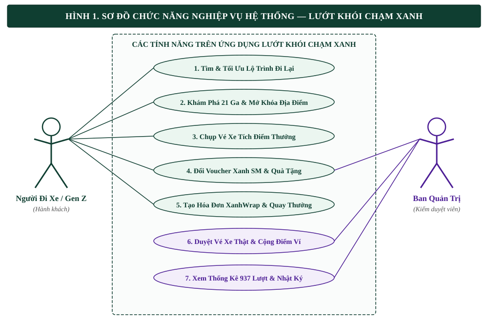
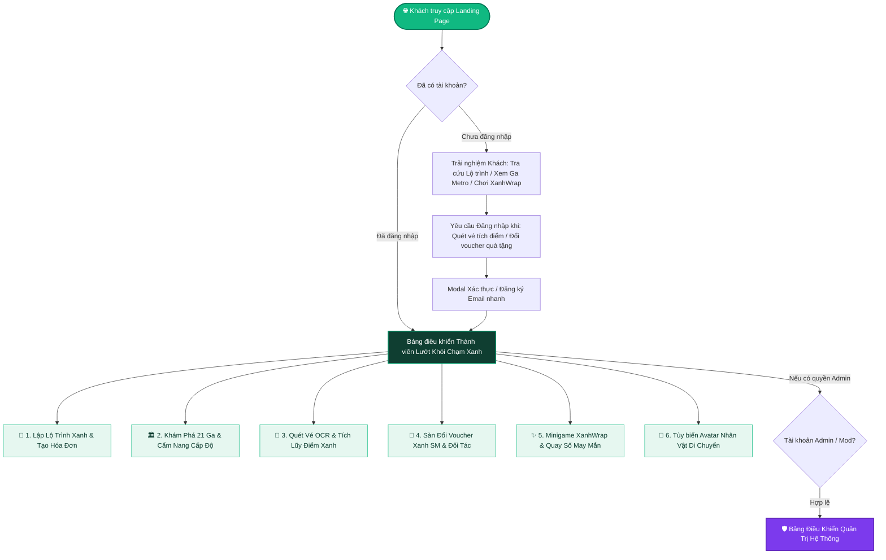
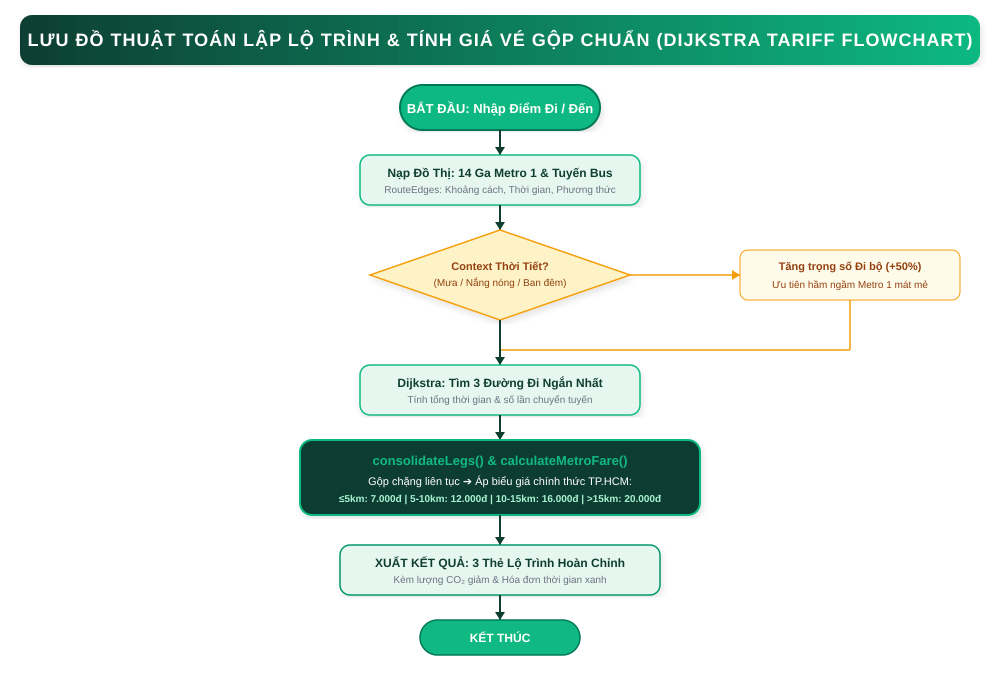
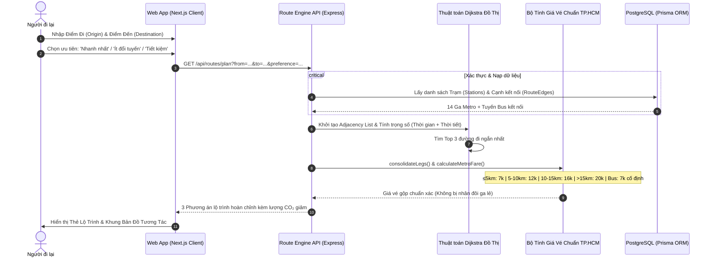
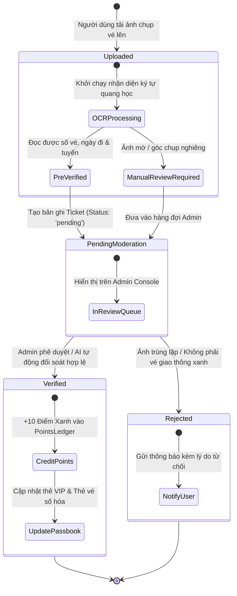
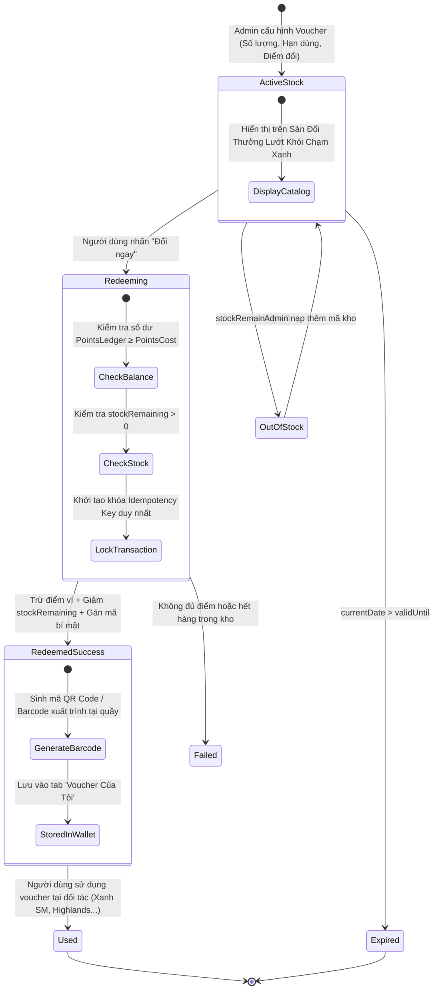
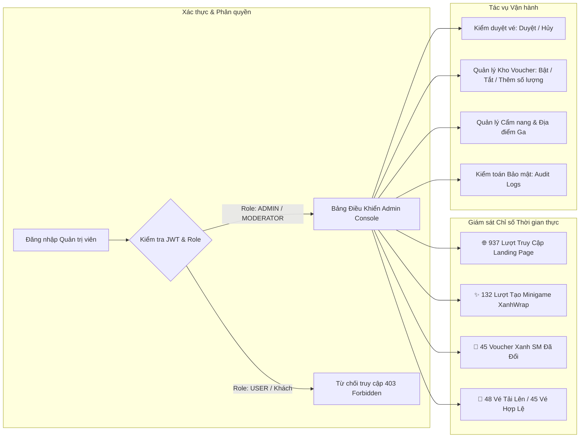

# 🗺️ 01. HỆ THỐNG USER FLOWS, STATE DIAGRAMS & USER JOURNEY MAPS
# CHIẾN DỊCH "LƯỚT KHÓI CHẠM XANH"

> **Dự án**: Nền Tảng Di Chuyển Xanh & Tích Lũy Điểm Thưởng TP. Hồ Chí Minh  
> **Thương hiệu**: **LƯỚT KHÓI CHẠM XANH**  
> **Tiêu chuẩn tài liệu**: Chuẩn phân tích luồng hệ thống quốc tế (UML / ISO 5807 / Agile Journey Mapping).

---

## 1. TỔNG QUAN HỆ THỐNG LUỒNG TƯƠNG TÁC (ECOSYSTEM FLOWCHART)

### 🖼️ Biểu Đồ UML Use Case Trực Quan (Vẽ bằng Diagrams.net / Draw.io):

*(Tệp nguồn chỉnh sửa kéo thả trực tiếp trên `https://app.diagrams.net`: [`01_use_case_diagram.drawio`](./diagrams/01_use_case_diagram.drawio))*

Sơ đồ tổng quan toàn bộ kiến trúc tương tác đa chức năng trên nền tảng **Lướt Khói Chạm Xanh**:



---

## 2. BẢN ĐỒ HÀNH TRÌNH TRẢI NGHIỆM NGƯỜI DÙNG (USER JOURNEY MAPS)

### 2.1. Hành trình Gen Z / Sinh viên: Minh Anh (20 tuổi) – Săn Vé & Đổi Voucher

```mermaid
journey
    title Hành trình Sinh viên khám phá Metro Số 1 & Đổi Voucher Xanh SM
    section Tiếp cận & Tìm đường
      Mở web Lướt Khói Chạm Xanh trên điện thoại: 5: Sinh viên
      Nhập điểm xuất phát KTX ĐHQG đến Ga Bến Thành: 5: Sinh viên
      Xem lộ trình tối ưu kết hợp Tuyến Bus 19 & Metro 1: 5: Hệ thống
      Nhận gợi ý tránh mưa và biểu giá chuẩn 12.000 VNĐ: 5: Hệ thống
    section Trải nghiệm thực tế
      Đi Metro Số 1 ngắm cảnh qua cầu Sài Gòn: 5: Sinh viên
      Chụp ảnh check-in & lưu lại vé Metro: 4: Sinh viên
    section Tích điểm & Đổi thưởng
      Tải ảnh vé lên hệ thống Lướt Khói Chạm Xanh: 5: Sinh viên
      Hệ thống quét OCR xác thực hợp lệ +10 Điểm Xanh: 5: Hệ thống
      Tích đủ 50 điểm đổi ngay Voucher Xanh SM 30.000đ: 5: Sinh viên
      Nhận mã ưu đãi tức thì & lưu vào ví cá nhân: 5: Hệ thống
    section Lan tỏa & Minigame
      Tạo thẻ tổng kết XanhWrap danh hiệu 'Thần Xe Bus Điện': 5: Sinh viên
      Chia sẻ lên story Facebook kèm hashtag #LuotKhoiChamXanh: 5: Sinh viên
```

---

## 3. SƠ ĐỒ LUỒNG CHI TIẾT TỪNG TÍNH NĂNG (DETAILED FEATURE FLOWS)

### 3.1. Luồng Lập lộ trình đa phương thức (Multi-modal Routing Sequence)

#### 🖼️ Lưu Đồ Thuật Toán Dijkstra & Tính Giá Vé Gộp (Vẽ bằng Diagrams.net / Draw.io):

*(Tệp nguồn chỉnh sửa kéo thả trực tiếp trên `https://app.diagrams.net`: [`03_dijkstra_multimodal_routing_flow.drawio`](./diagrams/03_dijkstra_multimodal_routing_flow.drawio))*



---

### 3.2. Luồng Khám phá 21 ga & Cơ chế Mở khóa Cấp độ (Station Discovery & Gamification)

```mermaid
flowchart TD
    A[Người dùng truy cập mục Khám phá ga] --> B[Hiển thị danh sách 14 Ga Metro Số 1]
    B --> C[Chọn một Ga ví dụ: Ga Bến Thành, Ba Son, Tân Cảng...]
    C --> D[Lọc theo danh mục: 🍜 Ăn uống | ☕ Cafe | 🏛️ Di tích | 🛍️ Mua sắm]
    
    D --> E[Hiển thị Lưới 21 Địa Điểm Thực Tế]
    
    E --> PlaceCheck{Trạng thái Địa điểm}
    
    PlaceCheck -->|⭐ 6 Địa điểm Đã Mở Khóa| FullArticle[Mở Modal 2 Cột Đầy Đủ Chi Tiết]
    FullArticle --> FA1[Cột Trái: Ảnh sắc nét + Địa chỉ + Giờ mở + Giá vé + Ga gần nhất]
    FullArticle --> FA2[Cột Phải: Bài viết hướng dẫn chi tiết + Điểm nổi bật + Cách đi Metro/Bus]
    
    PlaceCheck -->|🔒 15 Địa điểm Cấp Tiếp Theo| LockedModal[Mở Modal Khóa Cấp Độ Gamification]
    LockedModal --> LM1[Badge Tím: 🔒 SẮP MỞ KHÓA - CẤP TIẾP THEO]
    LockedModal --> LM2[Thông điệp: Tích cực tích lũy vé xe xanh để mở sớm]
    LockedModal --> LM3[Vẫn cung cấp: Địa chỉ chính xác, khoảng cách đi bộ và ga gần nhất]

    style FullArticle fill:#E6F7F0,stroke:#10B981,stroke-width:2px,color:#0F3E31
    style LockedModal fill:#FAF5FF,stroke:#7C3AED,stroke-width:2px,color:#5B21B6
```

---

### 3.3. Sơ đồ Chuyển trạng thái Vé Xanh (Ticket State Transition Diagram)



---

### 3.4. Sơ đồ Vòng đời Voucher & Cơ chế Đổi quà An toàn (Voucher Lifecycle & Idempotency)



---

### 3.5. Luồng Quản trị & Vận hành Chiến dịch (Admin Operations Flow)



---
*Tài liệu thuộc Bộ hồ sơ Tiêu chuẩn Thiết kế Hệ thống Lướt Khói Chạm Xanh.*
