# 📐 02. BẢN VẼ WIREFRAME & KIẾN TRÚC BỐ CỤC GIAO DIỆN (HI-FI WIREFRAMES)
# CHIẾN DỊCH "LƯỚT KHÓI CHẠM XANH"

> **Dự án**: Nền Tảng Di Chuyển Xanh & Tích Lũy Điểm Thưởng TP. Hồ Chí Minh  
> **Thương hiệu**: **LƯỚT KHÓI CHẠM XANH**  
> **Tiêu chuẩn tài liệu**: Chuẩn phân rã giao diện & Thiết kế hệ thống (Atomic Design & Responsive Grid Standards).

---

## 1. CÂY PHÂN CẤP MÀN HÌNH & ĐIỀU HƯỚNG (SCREEN HIERARCHY TREE)

```mermaid
graph TD
    Root[🌐 Single Page Application Root - Lướt Khói Chạm Xanh]
    
    Root --> Header[Header Kính Mờ: Logo Lướt Khói Chạm Xanh + Nav Rail + CTA Đăng nhập]
    
    Root --> Section1[📍 Màn hình Lập Lộ Trình: Khung Nhập Ga + Bộ Lọc + Bản Đồ + 3 Thẻ Lộ Trình]
    Section1 --> SubModal1[📄 Modal Hóa Đơn Thời Gian Xanh - TimeBill Card]
    
    Root --> Section2[🏛️ Màn hình Khám Phá Ga: Thanh 14 Ga Metro + Lưới 21 Địa Điểm]
    Section2 --> SubModal2[🏛️ Modal 2 Cột React Portal: Cột Ảnh/Liên Hệ + Cột Bài Viết/Lộ Trình]
    Section2 --> SubModal3[🔒 Modal Thông Báo Cấp Sau: Gamification Unlock Info]
    
    Root --> Section3[🎫 Màn hình Tích Điểm: Thẻ VIP Xanh + Khung Tải Vé OCR + Sổ Vé Điện Tử]
    Section3 --> SubModal4[📸 Modal Xem Trước & Xác Nhận Vé OCR]
    
    Root --> Section4[🎁 Màn hình Đổi Thưởng: Danh Mục Voucher Xanh SM, Highlands, Phúc Long...]
    Section4 --> SubModal5[🎟️ Modal Nhận Mã Ưu Đãi + Barcode Quét Tại Quầy]
    
    Root --> Section5[✨ Màn hình XanhWrap: Form Nhập Hành Trình + Canvas Xuất Poster + Form Gửi Link]
    
    Root --> Section6[📖 Màn hình Cẩm Nang: Danh Sách Cẩm Nang Xanh & Mẹo Đi Metro]
    
    Root --> Section7[🛡️ Màn hình Bảng Điều Khiển Admin: 4 Thẻ Chỉ Số + Quản Lý Vé/Voucher/Logs]
    
    Root --> Footer[Footer Chân Trang: Bản quyền Lướt Khói Chạm Xanh TP.HCM]

    style Root fill:#0F3E31,stroke:#10B981,stroke-width:2px,color:#fff
    style SubModal2 fill:#E6F7F0,stroke:#059669,stroke-width:2px,color:#0F3E31
    style SubModal5 fill:#FAF5FF,stroke:#7C3AED,stroke-width:2px,color:#5B21B6
```



---

## 2. QUY CHUẨN LƯỚI & KHUNG BỐ CỤC (LAYOUT GRID SYSTEM)

```text
DESKTOP VIEWPORT (≥ 1280px):
+-----------------------------------------------------------------------------------------------+
|  12-Column Grid | Max Width: 1280px (max-w-7xl) | Gutter: 24px (gap-6) | Padding: 32px (px-8) |
|  [ Col 1 ][ Col 2 ][ Col 3 ][ Col 4 ][ Col 5 ][ Col 6 ][ Col 7 ][ Col 8 ][ Col 9 ][Col10][Col11][Col12] |
+-----------------------------------------------------------------------------------------------+

TABLET VIEWPORT (768px - 1023px):
+-------------------------------------------------------------------------------+
|  8-Column Grid | Gutter: 16px (gap-4) | Side Padding: 24px (px-6)              |
|  [ Col 1 ][ Col 2 ][ Col 3 ][ Col 4 ][ Col 5 ][ Col 6 ][ Col 7 ][ Col 8 ]      |
+-------------------------------------------------------------------------------+

MOBILE VIEWPORT (390px - 640px):
+-----------------------------------------------+
|  4-Column Fluid Grid | Padding: 16px (px-4)   |
|  [ Col 1 ][ Col 2 ][ Col 3 ][ Col 4 ]         |
|  Touch Target tối thiểu: 44px x 44px          |
+-----------------------------------------------+
```

---

## 3. BẢN VẼ WIREFRAME CHI TIẾT TỪNG MÀN HÌNH (HI-FI WIREFRAMES)

### 3.1. Screen 1: Master Header & Hero Navigation

```text
+-------------------------------------------------------------------------------------------------------------+
|  🌿 LƯỚT KHÓI CHẠM XANH    [📍 Lộ trình] [🏛️ Khám phá] [🎫 Tích điểm] [🎁 Đổi quà] [✨ XanhWrap] [📖 Cẩm nang]  |  [🎫 Vé xanh] [👤 Đăng nhập]  |
|  (Chiến dịch xanh TP.HCM)  (Thanh cuộn ngang Nav-Rail mượt mà, active pill xanh ngọc)                          |  (Nút bấm viền bo tròn 9999px) |
+-------------------------------------------------------------------------------------------------------------+
|                                                                                                             |
|  🌿 CHIẾN DỊCH GIAO THÔNG ĐÔ THỊ BỀN VỮNG TP. HỒ CHÍ MINH                                                   |
|  =========================================================================================================  |
|  LƯỚT KHỎI KHÓI BỤI – CHẠM TRẢI NGHIỆM XANH                                                                 |
|  Khám phá Thành phố hiện đại cùng Tuyến Metro Số 1 & Xe buýt điện VinBus thông minh                         |
|                                                                                                             |
|  [  🚀 BẮT ĐẦU LẬP LỘ TRÌNH NGAY  ]        [  ✨ THAM GIA XANHWRAP NHẬN VOUCHER  ]                         |
|                                                                                                             |
|  ┌─────────────────────────────┐  ┌─────────────────────────────┐  ┌─────────────────────────────┐          |
|  │ 🚆 14 NHÀ GA METRO SỐ 1     │  │ ⚡ 100% XE BUÝT ĐIỆN VINBUS │  │ 🎁 KHO VOUCHER XANH SM     │          |
|  │ Kết nối Bến Thành - Thủ Đức │  │ Di chuyển êm ái, 0 phát thải│  │ Đổi quà giá trị từ vé thật  │          |
|  └─────────────────────────────┘  └─────────────────────────────┘  └─────────────────────────────┘          |
|                                                                                                             |
+-------------------------------------------------------------------------------------------------------------+
```

---

### 3.2. Screen 2: Công Cụ Lập Lộ Trình Xanh & Biểu Giá Chuẩn (Route Planner)

```text
+-------------------------------------------------------------------------------------------------------------+
|  📍 LẬP LỘ TRÌNH DI CHUYỂN XANH THÔNG MINH                                                                  |
+-------------------------------------------------------------+-----------------------------------------------+
|  NHẬP ĐIỂM ĐI & ĐIỂM ĐẾN:                                   |  🗺️ KHUNG XEM BẢN ĐỒ LỘ TRÌNH ĐA PHƯƠNG THỨC   |
|  ┌───────────────────────────────────────────────────────┐  |  +-----------------------------------------+  |
|  | 🟢 Điểm đi: [ Chọn Ga Metro / Vị trí của bạn        ] |  |  |  [+] Zoom In                            |  |
|  | 🔴 Điểm đến: [ Nhập Địa danh du lịch / TTTM / Ga đến ] |  |  |  [-] Zoom Out                           |  |
|  └───────────────────────────────────────────────────────┘  |  |                                         |  |
|                                                             |  |  (Hiển thị Tuyến Metro 1 Đường Đỏ/Xanh   |  |
|  TIÊU CHÍ ƯU TIÊN:                                          |  |   Các Trạm Trung Chuyển & Đi Bộ)        |  |
|  (•) ⚡ Nhanh nhất     ( ) 🔄 Ít chuyển tuyến   ( ) 💰 Tiết kiệm  |  |                                         |  |
|                                                             |  +-----------------------------------------+  |
|  ĐIỀU KIỆN THỜI TIẾT TỰ ĐỘNG TÍCH HỢP:                      |                                               |
|  [ ☀️ Trời nắng râm 31°C | Thuận lợi | Không mưa ]           |  KẾT QUẢ TỐI ƯU (TOP 3 PHƯƠNG ÁN):            |
|                                                             |  ┌─────────────────────────────────────────┐  |
|  [  🔍 TÌM LỘ TRÌNH TỐI ƯU NHẤT  ]                          |  │ 🥇 OPTION 1: METRO SỐ 1 TRỰC TIẾP       │  |
|                                                             |  │    ⏱️ 22 phút • 💰 12.000 VNĐ • 🌱 -450g CO₂│  |
|                                                             |  │    Chặng: Ga Bến Thành ➔ Ga Thảo Điền    │  |
|                                                             |  │    [ 📋 Xem Chi Tiết ] [ 📄 Tạo Hóa Đơn ]│  |
|                                                             |  └─────────────────────────────────────────┘  |
+-------------------------------------------------------------+-----------------------------------------------+
```

---

### 3.3. Screen 3: Khám Phá Ga & Modal 2 Cột Độc Quyền (Station Experience Modal)

```text
+-------------------------------------------------------------------------------------------------------------+
|  🏛️ KHÁM PHÁ GA METRO SỐ 1 & ĐỊA ĐIỂM TRẢI NGHIỆM ĐỘC QUYỀN                                                |
|  Bộ lọc: [ Tất cả (21) ] [ 🍜 Ẩm thực ] [ ☕ Quán Cafe ] [ 🏛️ Di tích ] [ 🛍️ TTTM Mua sắm ]                 |
+-------------------------------------------------------------------------------------------------------------+
|  LƯỚI ĐỊA ĐIỂM (HIỂN THỊ TRỌN VẸN 21 ĐỊA ĐIỂM):                                                             |
|  ┌───────────────────────────┐  ┌───────────────────────────┐  ┌───────────────────────────┐                |
|  | [ẢNH CHỢ BẾN THÀNH]       |  | [ẢNH PHỐ NGUYỄN HUỆ]      |  | [ẢNH BẢO TÀNG MỸ THUẬT]   |                |
|  | ⭐ NỔI BẬT                |  | ⭐ NỔI BẬT                |  | 🔒 SẮP MỞ KHÓA (CẤP SAU)  |                |
|  | Chợ Bến Thành             |  | Phố Đi Bộ Nguyễn Huệ      |  | Bảo Tàng Mỹ Thuật TP.HCM  |                |
|  | 📍 Ga Bến Thành (Đi bộ 2p)|  | 📍 Ga Nhà Hát TP (3p)     |  | 📍 Ga Bến Thành (4p)      |                |
|  | [ Xem cẩm nang chi tiết ] |  | [ Xem cẩm nang chi tiết ] |  | [ Xem điều kiện mở khóa ] |                |
|  └───────────────────────────┘  └───────────────────────────┘  └───────────────────────────┘                |
+=============================================================================================================+
|  KIẾN TRÚC MODAL 2 CỘT (RENDER QUA REACT PORTAL TRỰC TIẾP VÀO document.body - LOẠI BỎ LỖI BỊ CẮT XÉN):     |
|  +-------------------------------------------------------------------------------------------------------+  |
|  |  🏛️ CẨM NANG ĐỊA ĐIỂM: CHỢ BẾN THÀNH                                                       [ Đóng X ]  |  |
|  +-------------------------------------------------+-----------------------------------------------------+  |
|  |  CỘT TRÁI (THÔNG TIN TỔNG QUAN & LIÊN HỆ)        |  CỘT PHẢI (BÀI VIẾT HƯỚNG DẪN & LỘ TRÌNH ĐI LẠI)    |  |
|  |  ┌───────────────────────────────────────────┐  |  GIỚI THIỆU CHUNG:                                  |  |
|  |  │ [ Ảnh Chợ Bến Thành sắc nét - Bo góc 2xl ] │  |  Chợ Bến Thành là biểu tượng văn hóa lịch sử hơn   |  |
|  |  └───────────────────────────────────────────┘  |  100 năm tuổi của Sài Gòn, kết nối ngầm trực tiếp   |  |
|  |  📍 ĐỊA CHỈ: Đường Lê Lợi, P. Bến Thành, Quận 1 |  với Nhà Ga Trung Tâm Bến Thành hiện đại...         |  |
|  |  ⏰ GIỜ MỞ CỬA: 07:00 – 22:00 (Hàng ngày)      |                                                     |  |
|  |  🎟️ VÉ THAM QUAN: Miễn phí vào cửa tự do       |  🌟 ĐIỂM NHẤN TRẢI NGHIỆM ĐỘC ĐÁO:                  |  |
|  |  🚆 GA GẦN NHẤT: Ga Trung Tâm Bến Thành        |  • Tháp đồng hồ 4 mặt biểu tượng check-in kinh điển |  |
|  |  🚶 KHOẢNG CÁCH: 150m (Khoảng 2 phút đi bộ)    |  • Thiên đường ẩm thực chè & món ngon 3 miền        |  |
|  |                                                 |                                                     |  |
|  |  [ 🌐 Mở bản đồ Google ] [ 🚩 Lưu địa điểm ]   |  🚆 HƯỚNG DẪN DI CHUYỂN BẰNG METRO & BUS:           |  |
|  |                                                 |  Đi Metro Tuyến 1 xuống Ga Bến Thành, theo lối ra   |  |
|  |                                                 |  Cổng 1 để bước ngay vào sảnh trước của chợ.        |  |
|  +-------------------------------------------------+-----------------------------------------------------+  |
+=============================================================================================================+
```

---

### 3.4. Screen 4: Bảng Điều Khiển Quản Trị Hệ Thống (Admin Console Dashboard)

```text
+-------------------------------------------------------------------------------------------------------------+
|  🛡️ BẢNG ĐIỀU KHIỂN QUẢN TRỊ VIÊN — LƯỚT KHÓI CHẠM XANH                                                     |
|  [ 📊 Tổng quan ] [ 🎫 Kiểm duyệt vé ] [ 🎁 Quản lý Voucher ] [ 📝 Quản lý Địa điểm ] [ 📈 Thống kê Truy cập ]|
+-------------------------------------------------------------------------------------------------------------+
|                                                                                                             |
|  4 THẺ CHỈ SỐ HOẠT ĐỘNG CHÍNH (THEO DÕI THỜI GIAN THỰC):                                                    |
|  ┌─────────────────────────┐ ┌─────────────────────────┐ ┌─────────────────────────┐ ┌────────────────────┐|
|  | 🌐 TRUY CẬP LANDING     | | ✨ XANHWRAP ĐÃ TẠO      | | 🚗 VOUCHER XANH SM ĐÃ ĐỔI| | 🎫 VÉ XANH (DUYỆT/TỔNG|
|  |                         | |                         | |                         | |                      |
|  |         937 lượt        | |         132 bài         | |          45 mã          | |        45 / 48       |
|  | (Tự động tăng khi có IP)| | (Tích hợp quay số trúng)| | (Đồng hành taxi điện)   | | (45 vé đã đổi quà)   |
|  └─────────────────────────┘ └─────────────────────────┘ └─────────────────────────┘ └────────────────────┘|
|                                                                                                             |
|  NHẬT KÝ TRUY CẬP THỜI GIAN THỰC (REAL-TIME ACCESS LOGS):                                                   |
|  +---------------------------+-----------------------+---------------------+-------------------------------+|
|  | Trang truy cập            | Thiết bị / HĐH        | Trình duyệt         | Thời gian ghi nhận            |
|  +---------------------------+-----------------------+---------------------+-------------------------------+|
|  | /#stations                | Apple iPhone iOS 17   | Mobile Safari       | 10 giây trước                 |
|  | /#xanhwrap                | Windows PC Desktop    | Google Chrome 125   | 2 phút trước                  |
|  | /#route                   | Samsung Galaxy S24    | Chrome Mobile       | 5 phút trước                  |
|  +---------------------------+-----------------------+---------------------+-------------------------------+|
|                                                                                                             |
+-------------------------------------------------------------------------------------------------------------+
```

---

## 4. KIẾN TRÚC MODAL WINDOWING QUA REACT PORTAL

```text
DOM TREE HIERARCHY TRONG ỨNG DỤNG:
body
 ├── div#__next (Root Application Container: overflow-hidden / h-dvh)
 │    ├── header.glass-header
 │    └── main (Pages & Tab Views)
 │
 └── div.portal-root (GẮN TRỰC TIẾP VÀO document.body)
      └── div.fixed.inset-0.z-[9999] (Modal Overlay Toàn Màn Hình)
           ├── div.absolute.inset-0.bg-black/60.backdrop-blur-md (Backdrop chống click xuyên)
           └── div.relative.w-full.max-w-4xl.max-h-[90vh].overflow-y-auto (Modal 2 Cột Chuẩn UX)
```

---
*Tài liệu thuộc Bộ hồ sơ Tiêu chuẩn Thiết kế Hệ thống Lướt Khói Chạm Xanh.*
