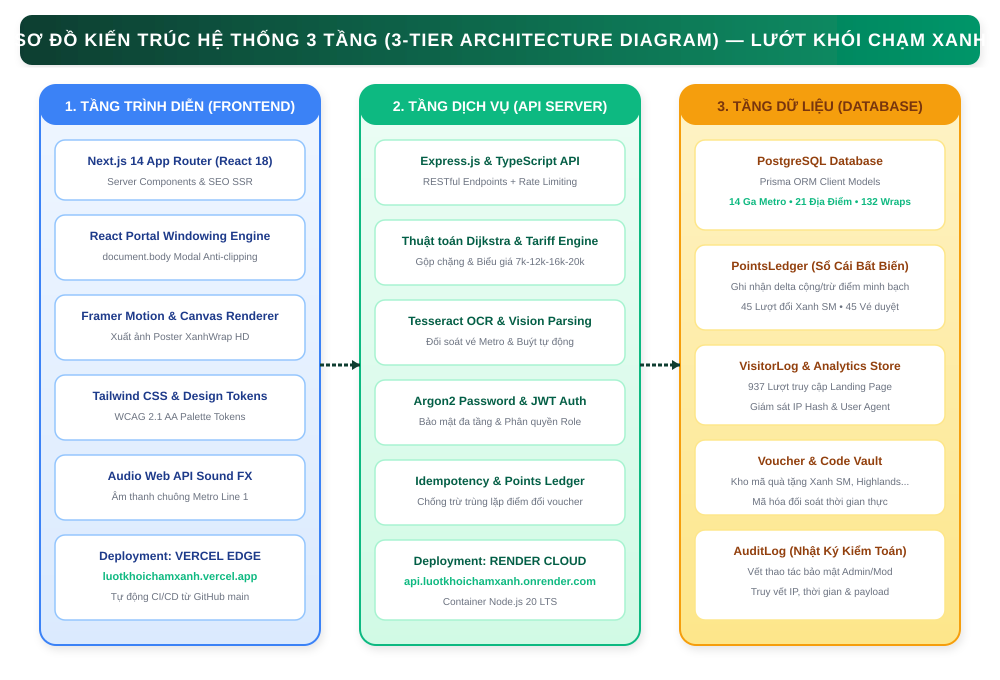
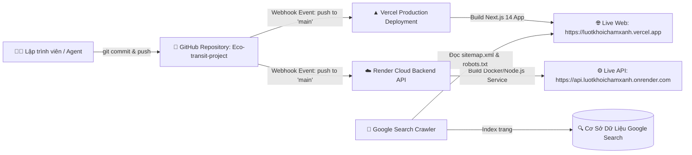

# 🎨 03. HỆ THỐNG THIẾT KẾ DESIGN SYSTEM & QUY CHUẨN UX/UI PROTOTYPE
# CHIẾN DỊCH "LƯỚT KHÓI CHẠM XANH"

> **Dự án**: Nền Tảng Di Chuyển Xanh & Tích Lũy Điểm Thưởng TP. Hồ Chí Minh  
> **Thương hiệu**: **LƯỚT KHÓI CHẠM XANH**  
> **Tiêu chuẩn tài liệu**: Chuẩn Design System Tokens & WCAG 2.1 AA Accessibility Standards.

---

## 1. HỆ THỐNG BIẾN THIẾT KẾ (DESIGN SYSTEM TOKENS)

### 1.1. Bảng Màu Thương Hiệu (Color Palette)

```css
/* Core Green Identity */
--eco-primary: #0F3E31;          /* Xanh lá rừng đậm - Nhận diện chính, text tiêu đề */
--eco-primaryDeep: #082820;      /* Xanh bóng đêm - Nền thẻ VIP, Header, Footer */
--eco-accentGreen: #10B981;      /* Xanh ngọc lục bảo tươi sáng - Nút bấm chính, Icon active */
--eco-accentGreenDeep: #059669;  /* Xanh ngọc đậm - Nút bấm khi hover, Text liên kết */
--eco-mint: #E6F7F0;             /* Xanh bạc hà nhẹ - Nền pill badge, border viền thẻ */

/* Neutral & Background Surfaces */
--eco-soft: #F4FBF7;             /* Trắng ngọc dịu mắt - Nền tổng thể toàn trang */
--eco-bgBeige: #FDFBF7;          /* Kem ấm áp - Nền thẻ vé giấy & thẻ quà tặng */
--eco-ink: #111827;              /* Đen than chì Slate 900 - Văn bản nội dung chính */
--eco-muted: #6B7280;            /* Xám trung tính Gray 500 - Chú thích & Ngày giờ */

/* Gamification & Operational Badges */
--badge-featured: #F59E0B;       /* Vàng hổ phách - Badge ⭐ NỔI BẬT */
--badge-upcoming: #7C3AED;       /* Tím thạch anh - Badge 🔒 SẮP MỞ KHÓA (CẤP SAU) */
--badge-verified: #10B981;       /* Xanh lục - Vé đã duyệt & Voucher hợp lệ */
--badge-pending: #3B82F6;        /* Xanh dương - Đang chờ kiểm duyệt */
```

### 1.2. Độ Tương Phản & Chuẩn Trợ Năng (WCAG 2.1 AA Compliance)

| Cặp Màu Kiểm Định | Tỷ Lệ Tương Phản | Đạt Chuẩn WCAG | Ứng Dụng Thực Tế |
| :--- | :---: | :---: | :--- |
| **`#0F3E31` (Eco Primary) trên `#FFFFFF`** | **11.4 : 1** | **AAA** | Tiêu đề chính, thanh điều hướng Header |
| **`#10B981` (Accent Green) trên `#0F3E31`** | **4.8 : 1** | **AA** | Nút bấm trên nền tối, thanh tiến trình |
| **`#111827` (Eco Ink) trên `#F4FBF7`** | **14.2 : 1** | **AAA** | Nội dung bài viết, thông tin chi tiết ga |
| **`#7C3AED` (Upcoming Purple) trên `#FAF5FF`**| **6.2 : 1** | **AA** | Huy hiệu cấp độ Gamification sắp mở |

---

## 2. HỆ THỐNG KIỂU CHỮ (TYPOGRAPHY SYSTEM)

* **Font Tiêu Đề & Nhận Diện**: Google Font **`Outfit`** (`var(--font-outfit)`)
* **Font Văn Bản & Thao Tác UI**: Google Font **`Inter`** (`var(--font-inter)`)

```css
/* Typography Scale Matrix */
.font-hero {
  font-family: var(--font-outfit);
  font-weight: 900;
  font-size: clamp(2rem, 5vw, 3.5rem);
  line-height: 1.1;
  letter-spacing: -0.03em;
  text-transform: uppercase;
}

.font-section-title {
  font-family: var(--font-outfit);
  font-weight: 800;
  font-size: clamp(1.25rem, 3vw, 1.75rem);
  line-height: 1.2;
  letter-spacing: -0.02em;
  text-transform: uppercase;
}

.font-card-title {
  font-family: var(--font-outfit);
  font-weight: 700;
  font-size: 1rem;
  line-height: 1.3;
}

.font-body-regular {
  font-family: var(--font-inter);
  font-weight: 400;
  font-size: 0.875rem; /* 14px */
  line-height: 1.6;
}

.font-caption {
  font-family: var(--font-inter);
  font-weight: 600;
  font-size: 0.6875rem; /* 11px */
  letter-spacing: 0.05em;
  text-transform: uppercase;
}
```

---

## 3. VI TƯƠNG TÁC CHUYỂN ĐỘNG & MOTION PHYSICS

```typescript
// Motion Config Tokens (Framer Motion)
export const springTransition = {
  type: "spring",
  stiffness: 400,
  damping: 30,
};

export const modalBackdropVariants = {
  hidden: { opacity: 0 },
  visible: { opacity: 1, transition: { duration: 0.2, ease: "easeOut" } },
  exit: { opacity: 0, transition: { duration: 0.15, ease: "easeIn" } },
};

export const modalScaleVariants = {
  hidden: { opacity: 0, scale: 0.95, y: 15 },
  visible: { 
    opacity: 1, 
    scale: 1, 
    y: 0, 
    transition: { type: "spring", stiffness: 350, damping: 28 } 
  },
  exit: { opacity: 0, scale: 0.96, y: 10, transition: { duration: 0.15 } },
};

export const ticketCardFlipVariants = {
  front: { rotateY: 0, transition: { duration: 0.6, ease: [0.16, 1, 0.3, 1] } },
  back: { rotateY: 180, transition: { duration: 0.6, ease: [0.16, 1, 0.3, 1] } },
};
```

---

## 4. MA TRẬN TRẠNG THÁI NÚT BẤM & THÀNH PHẦN (COMPONENT STATE MATRIX)

```text
BUTTON COMPONENT STATES:
┌───────────────────┬────────────────────────────────────────────────────────┐
│ Trạng Thái        │ Thuộc Tính CSS & Hiệu Ứng                             │
├───────────────────┼────────────────────────────────────────────────────────┤
│ Default           │ bg-eco-accentGreen text-white font-bold rounded-2xl    │
│ Hover             │ bg-eco-accentGreenDeep scale-[1.02] shadow-lg          │
│ Active (Nhấn giữ) │ scale-95 shadow-inner transition-all duration-100      │
│ Focus-Visible     │ ring-4 ring-eco-accentGreen/30 outline-none            │
│ Disabled          │ opacity-50 cursor-not-allowed pointer-events-none      │
│ Loading           │ animate-pulse cursor-wait (Hiển thị Spinner SVG)       │
└───────────────────┴────────────────────────────────────────────────────────┘
```

---

## 5. CƠ CHẾ GOOGLE SEARCH INDEXING & TÊN MIỀN DEPLOYMENT

### 5.1. Giải đáp Về Tên Miền & Tìm Kiếm Trên Google

* **Câu hỏi**: *Có bắt buộc phải mua tên miền riêng `.vn` / `.com` mới tìm kiếm ra trên Google không?*
* **Khẳng định Chuyên Môn**: **KHÔNG BẮT BUỘC**.
  1. Google Search Engine lập chỉ mục (index) tất cả các trang web công khai có nội dung hợp lệ và có thể thu thập dữ liệu (crawling). Các tên miền mặc định của Vercel (`*.vercel.app`) hoặc Render (`*.onrender.com`) **hoàn toàn có thể được Google lập chỉ mục và hiển thị trên trang kết quả tìm kiếm Google (SERP)**.
  2. Việc đã cấu hình đầy đủ:
     * **`sitemap.xml`** (`apps/web/app/sitemap.ts`)
     * **`robots.txt`** (`apps/web/app/robots.ts`)
     * **Thẻ Meta Title & Description độc nhất**: *"Lướt Khói Chạm Xanh — Nền tảng di chuyển xanh & tích lũy điểm thưởng tại TP.HCM"*
     * **JSON-LD Schema.org** (`@type: WebApplication`)
     giúp Googlebot nhận diện chính xác danh mục ứng dụng giao thông xanh.
  3. **Lời khuyên thực tế**: Khi dự án đi vào giai đoạn quảng bá diện rộng, việc gắn thêm **Custom Domain** (ví dụ `luotkhoichamxanh.vn`) sẽ giúp tăng độ uy tín thương hiệu (Brand Authority) và đẩy thứ hạng từ khóa lên vị trí Top 1 nhanh hơn.

### 5.2. Sơ Đồ Kiến Trúc Hệ Thống & Luồng CI/CD Tự Động Hóa

#### 🖼️ Sơ Đồ Kiến Trúc 3 Tầng Chi Tiết (Vẽ bằng Diagrams.net / Draw.io):

*(Tệp nguồn chỉnh sửa kéo thả trực tiếp trên `https://app.diagrams.net`: [`02_system_architecture_diagram.drawio`](./diagrams/02_system_architecture_diagram.drawio))*



---
*Tài liệu thuộc Bộ hồ sơ Tiêu chuẩn Thiết kế Hệ thống Lướt Khói Chạm Xanh.*
