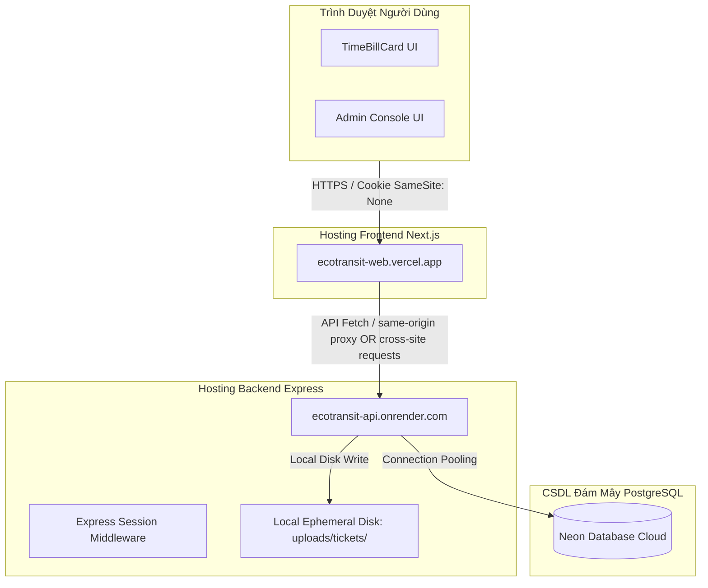

# Hướng Dẫn Deploy Bản Demo Công Khai — EcoTransit

Tài liệu này hướng dẫn chi tiết cách thiết lập, cấu hình và triển khai hệ thống **EcoTransit / Lướt Khói Chạm Xanh** lên các dịch vụ đám mây miễn phí: **Vercel** (Frontend), **Render** (Backend API) và **Neon** (Database PostgreSQL).

---

## 1. Sơ Đồ Kiến Trúc Triển Khai (Deployment Topology)

Hệ thống hoạt động dưới cấu trúc Monorepo, được chia làm các khối dịch vụ độc lập kết nối qua môi trường mạng HTTPS bảo mật:



Có 2 phương án định tuyến API (Topology Options):
- **Phương án A (Cross-origin - Khuyên Dùng)**: Gọi API trực tiếp qua tên miền Render `NEXT_PUBLIC_API_BASE_URL=https://ecotransit-api.onrender.com`. Phải thiết lập CORS whitelist chính xác và cookie cấu hình `secure: true; sameSite: "none"`.
- **Phương án B (Proxy rewrite)**: Cấu hình Next.js proxy rewrite qua `vercel.json` để chuyển tiếp `/api/*` sang Render. Khi đó web gọi API dưới dạng cùng nguồn (same-origin relative paths) giúp giảm thiểu độ phức tạp cấu hình cookie ở client.

---

## 2. Các Bước Thiết Lập Từng Dịch Vụ

### Bước 2.1. Cài Đặt Neon PostgreSQL
Neon cung cấp CSDL PostgreSQL serverless tối ưu và kết nối ổn định:
1. Đăng ký tài khoản tại [Neon.tech](https://neon.tech/).
2. Tạo Project mới tên là `ecotransit-project`.
3. Neon sẽ cấp 2 chuỗi kết nối:
   - **Connection Pooling URL (DATABASE_URL)**: Dành cho backend khi vận hành (host có dạng `-pooler`).
   - **Direct Connection URL (DIRECT_URL)**: Dành cho Prisma khi chạy thay đổi cấu trúc bảng (host không chứa `-pooler`).

### Bước 2.2. Triển Khai Backend API Trên Render
1. Kết nối tài khoản GitHub của bạn với Render.com.
2. Tạo một **Web Service** mới và trỏ đến repository của dự án.
3. Cấu hình các thông số cơ bản:
   - **Name**: `ecotransit-api`
   - **Runtime**: `Node`
   - **Build Command**: `npm install && npm run build`
   - **Start Command**: `npm run start --workspace=apps/api`
   - **Plan**: Chọn **Free**.
4. Cấu hình các biến môi trường trong mục **Advanced**:
   - `NODE_ENV`: `production`
   - `APP_MODE`: `demo`
   - `PROVIDER_MODE`: `free_demo`
   - `DATABASE_URL`: *(Dán chuỗi Connection Pooling URL từ Neon)*
   - `DIRECT_URL`: *(Dán chuỗi Direct Connection URL từ Neon)*
   - `SESSION_SECRET`: *(Chuỗi khóa ngẫu nhiên dài để bảo mật phiên)*
   - `CORS_ORIGIN`: `https://ecotransit-web.vercel.app` *(Thay thế bằng URL Vercel thực tế)*
   - `COOKIE_SECURE`: `true`
   - `COOKIE_SAME_SITE`: `none`
   - `REDIS_ENABLED`: `false`
   - `UPLOAD_DIR`: `uploads/tickets`
   - `MAIL_PROVIDER`: `brevo_http` hoặc `smtp` (mặc định nếu để trống)
   - *(Nếu sử dụng `smtp`)* `SMTP_HOST`, `SMTP_PORT`, `SMTP_USER`, `SMTP_PASS`, `SMTP_FROM`
   - *(Nếu sử dụng `brevo_http`)* `BREVO_API_KEY`, `BREVO_SENDER_EMAIL`, `BREVO_SENDER_NAME`

### Bước 2.3. Triển Khai Frontend Next.js Trên Vercel
1. Trên Vercel Dashboard, import dự án từ GitHub.
2. Thiết lập cấu hình dự án:
   - **Framework Preset**: `Next.js`
   - **Root Directory**: Giữ nguyên root hoặc `./` (Vercel tự nhận diện cấu trúc Monorepo).
   - **Build Command**: `npm run build` hoặc cấu hình cụ thể nếu cần cô lập.
3. Cấu hình các biến môi trường:
   - `NEXT_PUBLIC_API_BASE_URL`: `https://ecotransit-api.onrender.com` *(Địa chỉ URL API cấp bởi Render)*
   - `NEXT_PUBLIC_SITE_URL`: `https://ecotransit-web.vercel.app` *(Địa chỉ URL trang web cấp bởi Vercel)*
4. Nhấn **Deploy**. Sau khi hoàn tất, lấy URL thực tế quay lại cấu hình `CORS_ORIGIN` và `FRONTEND_URL` trên Render.

---

## 3. Khởi Tạo Cơ Sở Dữ Liệu Trên Neon

Để đưa CSDL Neon vào hoạt động, hãy chạy các lệnh sau từ máy cục bộ đã thiết lập biến môi trường trỏ đến Neon:

1. **Khởi tạo cấu trúc bảng**:
   ```powershell
   npm run db:push
   ```
2. **Nạp dữ liệu mẫu sạch phục vụ trình diễn**:
   ```powershell
   npm run demo:reset
   ```

---

## 4. Các Lưu Ý Vận Hành & Hạn Chế Bản Demo (Known Limitations)

### 4.1. Khởi Động Nguội (Cold Start) Trên Render Free Tier
Máy chủ của Render ở gói Free sẽ tự động đi vào trạng thái ngủ nếu không có lưu lượng truy cập trong vòng 15 phút. Khi có yêu cầu truy cập mới, máy chủ cần từ 50-90 giây để khởi động lại. Người dùng truy cập lần đầu sẽ gặp màn hình chờ Waking Up của EcoTransit.

### 4.2. Bộ Nhớ Tải Lên Tạm Thời (Ephemeral Storage)
Bản demo này lưu trữ các ảnh vé xe tải lên cục bộ tại thư mục `uploads/tickets`. Do Render Web Service sử dụng ephemeral disk ở gói miễn phí:
- **Giới hạn**: Mọi tệp ảnh tải lên sẽ bị xóa sạch khi dịch vụ Render khởi động lại (restart), cập nhật cấu hình hoặc redeploy.
- **Cam kết**: Hệ thống không sử dụng các dịch vụ lưu trữ ngoài (S3/Cloudinary) để tránh phát sinh chi phí ở Batch 07. CSDL vẫn lưu vết thông tin và OCR vé, nhưng ảnh vật lý sẽ báo lỗi 404 khi truy cập thumbnail nếu tệp đã bị xóa khỏi đĩa tạm.

### 4.3. Quản Trị Trực Quan & Bảo Mật Admin Console
Bảng điều khiển quản trị (`AdminConsoleSection`) đã được bảo vệ nghiêm ngặt:
- Chỉ hiển thị trực quan trên giao diện khi người dùng đăng nhập bằng tài khoản có vai trò `ADMIN` hoặc `MODERATOR`.
- Không hiển thị bất kỳ thông tin mật khẩu hay tài khoản quản trị nào trên giao diện công khai. Các tài khoản này chỉ được chia sẻ riêng trong tài liệu [DEMO_RUNBOOK.md](DEMO_RUNBOOK.md).

---

## 5. Quy Trình Rollback & Cập Nhật (Rollback Notes)
- **Trường hợp lỗi xảy ra sau bản cập nhật**: Trỏ Render/Vercel commit ngược về phiên bản SHA ổn định gần nhất trên Git và bấm Redeploy.
- **Trường hợp dữ liệu demo bị hỏng**: Chạy lại câu lệnh `npm run demo:reset` từ máy cục bộ để xóa và thiết lập lại dữ liệu trình diễn chuẩn.
