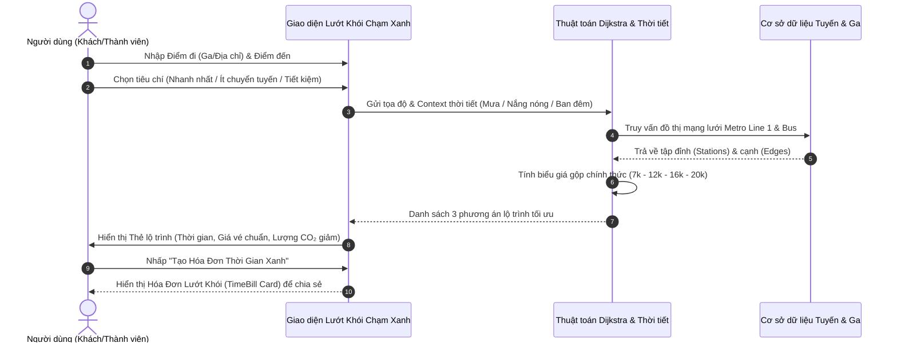
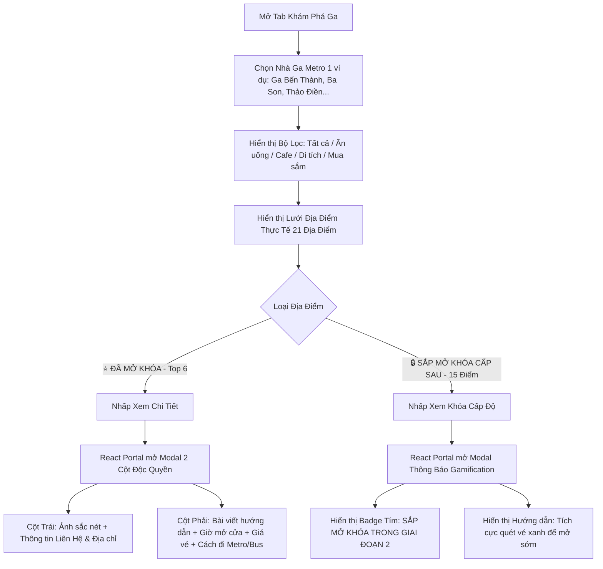
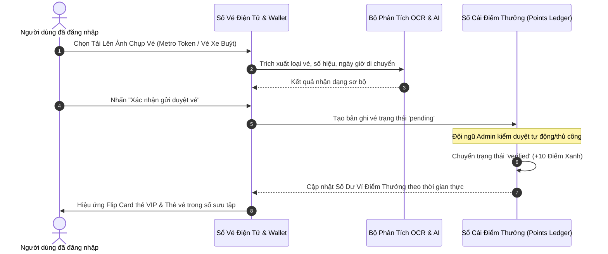
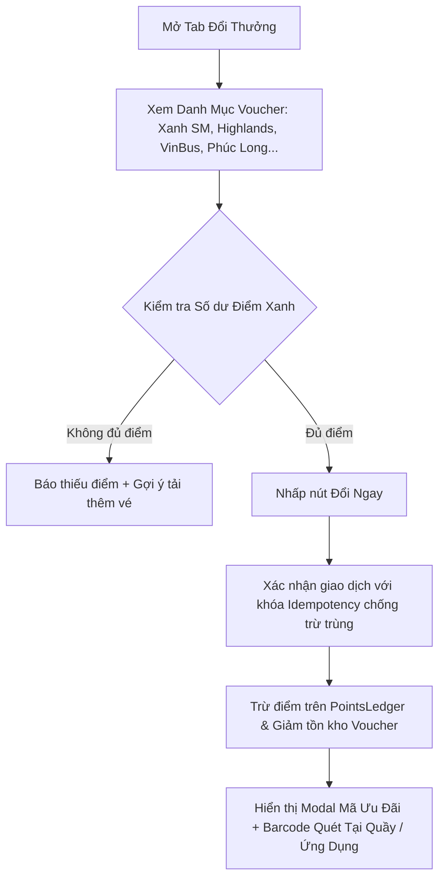
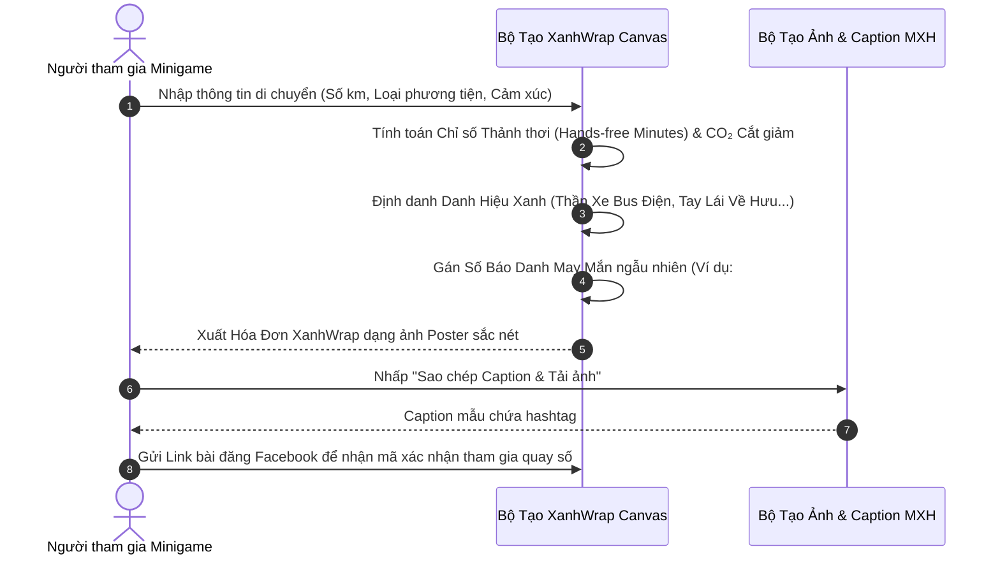
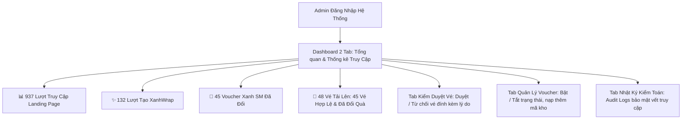

# 🌿 BỘ HỒ SƠ THIẾT KẾ UX/UI, USER FLOW & WIREFRAME CHI TIẾT
# CHIẾN DỊCH "LƯỚT KHÓI CHẠM XANH"

> **Dự án**: Nền Tảng Di Chuyển Xanh & Tích Lũy Điểm Thưởng Đô Thị TP. Hồ Chí Minh  
> **Tên thương hiệu duy nhất**: **LƯỚT KHÓI CHẠM XANH**  
> **Phiên bản tài liệu**: 2.0 (Production Release)  
> **Đối tượng áp dụng**: Ban Dự Án, Đội Ngũ Phát Triển (Fullstack Developers), Chuyên Gia Đánh Giá UX/UI, Đối Tác Vận Hành.

---

## MỤC LỤC
1. [TỔNG QUAN CHIẾN DỊCH & ĐỊNH VỊ THƯƠNG HIỆU](#1-tổng-quan-chiến-dịch--định-vị-thương-hiệu)
2. [HỆ THỐNG USER PERSONAS & NHU CẦU NGƯỜI DÙNG](#2-hệ-thống-user-personas--nhu-cầu-người-dùng)
3. [SƠ ĐỒ LUỒNG NGƯỜI DÙNG TOÀN DIỆN (USER FLOWS)](#3-sơ-đồ-luồng-người-dùng-toàn-diện-user-flows)
   - 3.1. Luồng 1: Tra cứu & Tối ưu lộ trình đa phương thức (Route Planner)
   - 3.2. Luồng 2: Khám phá nhà ga & Cẩm nang mở khóa cấp độ (Station Experience)
   - 3.3. Luồng 3: Tải ảnh vé, OCR & Quản lý sổ vé điện tử (Ticket Wallet)
   - 3.4. Luồng 4: Đổi voucher ưu đãi đối tác (Voucher Marketplace)
   - 3.5. Luồng 5: Minigame cá nhân hóa XanhWrap & Lan tỏa mạng xã hội
   - 3.6. Luồng 6: Quản trị & Vận hành chiến dịch (Admin Console)
4. [BẢN VẼ WIREFRAME CẤU TRÚC CHI TIẾT (HI-FI WIREFRAMES)](#4-bản-vẽ-wireframe-cấu-trúc-chi-tiết-hi-fi-wireframes)
   - 4.1. Screen 1: Trang chủ & Header điều hướng trung tâm
   - 4.2. Screen 2: Bảng lập lộ trình xanh (Route Planning Engine)
   - 4.3. Screen 3: Khám phá ga & Modal chi tiết 2 cột (Station Experience Modal)
   - 4.4. Screen 4: Ví điểm thưởng & Sổ vé điện tử (Ticket Passbook)
   - 4.5. Screen 5: Sàn đổi quà & Voucher điện tử (Voucher Redemptions)
   - 4.6. Screen 6: Minigame XanhWrap & Hóa đơn tự hào (Green Receipt)
   - 4.7. Screen 7: Bảng điều khiển Quản trị viên (Admin Dashboard)
5. [QUY CHUẨN THIẾT KẾ UX/UI & DESIGN SYSTEM](#5-quy-chuẩn-thiết-kế-uxui--design-system)
   - 5.1. Bảng màu chủ đạo (Color Palette Tokens)
   - 5.2. Hệ thống kiểu chữ (Typography System)
   - 5.3. Hiệu ứng chuyển động & Tương tác vi mô (Micro-interactions)
   - 5.4. Quy chuẩn Responsive & Tương thích đa thiết bị (Breakpoint Specs)
6. [CHIẾN LƯỢC TỐI ƯU HÓA TÌM KIẾM GOOGLE (SEO SPECIFICATION)](#6-chiến-lược-tối-ưu-hóa-tìm-kiếm-google-seo-specification)

---

## 1. TỔNG QUAN CHIẾN DỊCH & ĐỊNH VỊ THƯƠNG HIỆU

* **Tên chiến dịch chuẩn hóa**: **LƯỚT KHÓI CHẠM XANH**
* **Slogan định vị**: *"Lướt Khỏi Khói Bụi – Chạm Trải Nghiệm Xanh"*
* **Sứ mệnh**: Thúc đẩy thói quen sử dụng phương tiện giao thông công cộng (Tuyến Metro Số 1 Bến Thành – Suối Tiên, Hệ thống xe buýt điện VinBus, Xe buýt đô thị) thông qua cơ chế Gamification (trò chơi hóa), tích lũy điểm thưởng từ vé thật và đổi quà giá trị từ các thương hiệu đồng hành (Xanh SM, Highlands Coffee, Phúc Long, VinBus...).

---

## 2. HỆ THỐNG USER PERSONAS & NHU CẦU NGƯỜI DÙNG

| Persona | Chân dung & Độ tuổi | Động lực chính | Hành vi đặc thù trên ứng dụng |
| :--- | :--- | :--- | :--- |
| **Sinh viên / Gen Z (Minh Anh, 20 tuổi)** | Sinh viên ĐHQG TP.HCM, di chuyển hàng ngày dọc Xa lộ Hà Nội | Tiết kiệm chi phí, săn voucher nước uống, thích check-in sống ảo | Dùng Route Planner tìm chuyến ít chuyển tuyến, chơi XanhWrap khoe mạng xã hội, quét vé đổi voucher Highlands/Phúc Long |
| **Nhân viên văn phòng (Hoàng Nam, 28 tuổi)** | Làm việc tại Quận 1, nhà ở TP. Thủ Đức | Tránh kẹt xe giờ cao điểm, không gian mát mẻ, tận dụng thời gian đọc sách | Xem dự báo thời tiết tích hợp, đi Metro 1 tránh mưa/nắng, lưu hóa đơn xanh để theo dõi lượng CO₂ cắt giảm |
| **Khách du lịch / Khám phá (Thu Trang, 24 tuổi)** | Thích trải nghiệm các địa điểm văn hóa dọc tuyến Metro | Tìm kiếm địa điểm ăn uống, quán cafe, di tích gần ga Metro | Dùng tính năng "Khám phá ga", mở bài viết chi tiết để xem khoảng cách đi bộ, giờ mở cửa và tuyến bus kết nối |
| **Quản trị viên / Đội kiểm duyệt (Admin)** | Đội ngũ vận hành chiến dịch TP.HCM | Giám sát chỉ số thời gian thực, duyệt vé hợp lệ, điều phối kho voucher | Sử dụng Admin Console: duyệt vé OCR, kiểm tra 937 lượt truy cập, 132 bài XanhWrap, 45 voucher Xanh SM |

---

## 3. SƠ ĐỒ LUỒNG NGƯỜI DÙNG TOÀN DIỆN (USER FLOWS)

### 3.1. Luồng 1: Tra cứu & Tối ưu lộ trình đa phương thức (Route Planner)



---

### 3.2. Luồng 2: Khám phá nhà ga & Cẩm nang mở khóa cấp độ (Station Experience)



---

### 3.3. Luồng 3: Tải ảnh vé, OCR & Quản lý sổ vé điện tử (Ticket Wallet)



---

### 3.4. Luồng 4: Đổi voucher ưu đãi đối tác (Voucher Marketplace)



---

### 3.5. Luồng 5: Minigame cá nhân hóa XanhWrap & Lan tỏa mạng xã hội



---

### 3.6. Luồng 6: Quản trị & Vận hành chiến dịch (Admin Console)



---

## 4. BẢN VẼ WIREFRAME CẤU TRÚC CHI TIẾT (HI-FI WIREFRAMES)

### 4.1. Screen 1: Trang chủ & Header điều hướng trung tâm

```text
+--------------------------------------------------------------------------------------------------+
|  🌿 LƯỚT KHÓI CHẠM XANH   [Lộ trình] [Khám phá] [Tích điểm] [Đổi thưởng] [XanhWrap] [Cẩm nang]  | [🎫 Vé xanh] [👤 Đăng nhập] |
+--------------------------------------------------------------------------------------------------+
|                                                                                                  |
|   🌱 CHIẾN DỊCH DI CHUYỂN XANH TP. HỒ CHÍ MINH                                                   |
|   ============================================================================================   |
|   LƯỚT KHỎI KHÓI BỤI – CHẠM TRẢI NGHIỆM XANH CÙNG METRO SỐ 1 & VINBUS                            |
|                                                                                                  |
|   [  🚀 BẮT ĐẦU LẬP LỘ TRÌNH  ]      [  🎮 THAM GIA XANHWRAP NHẬN QUÀ  ]                        |
|                                                                                                  |
|   +------------------------------------------------------------------------------------------+   |
|   | ⚡ ĐIỂM NHẤN CHIẾN DỊCH:                                                                  |   |
|   | • 14 Ga Metro Số 1 Hiện Đại   • Hệ Thống Bus Điện Thông Minh   • Kho Quà Xanh SM Hấp Dẫn |   |
|   +------------------------------------------------------------------------------------------+   |
|                                                                                                  |
+--------------------------------------------------------------------------------------------------+
```

---

### 4.2. Screen 2: Bảng lập lộ trình xanh (Route Planning Engine)

```text
+--------------------------------------------------------------------------------------------------+
|  📍 BẢNG LẬP LỘ TRÌNH DI CHUYỂN XANH THÔNG MINH                                                  |
+----------------------------------------------------+---------------------------------------------+
|  [ Ô nhập: Điểm xuất phát (Ga / Vị trí hiện tại) ]  |  🗺️ KHUNG XEM BẢN ĐỒ TƯƠNG TÁC             |
|  [ Ô nhập: Điểm đến (Địa danh / Ga Metro Số 1)   ]  |  +---------------------------------------+  |
|                                                    |  |  (Hiển thị Tuyến Metro 1 Màu Đỏ/Xanh   |  |
|  TIÊU CHÍ ƯU TIÊN:                                 |  |   Các Điểm Dừng & Trạm Xe Buýt)       |  |
|  (•) Nhanh nhất    ( ) Ít chuyển tuyến   ( ) Tiết kiệm |  |                                         |  |
|                                                    |  +---------------------------------------+  |
|  THỜI TIẾT TỰ ĐỘNG: [ ☀️ Nắng râm 31°C | Không mưa ] |                                             |
|                                                    |  DANH SÁCH 3 PHƯƠNG ÁN TỐI ƯU:              |
|  [  🔍 TÌM LỘ TRÌNH TỐI ƯU NGAY  ]                 |  ┌───────────────────────────────────────┐  |
|                                                    |  | 🥇 OPTION 1: METRO SỐ 1 TRỰC TIẾP     |  |
|                                                    |  |    ⏱️ 22 phút  •  💰 12.000 VNĐ       |  |
|                                                    |  |    🌱 Giảm 450g CO₂  •  ⭐ Điểm: 95/100|  |
|                                                    |  |    [ Xem chi tiết từng chặng ]        |  |
|                                                    |  |    [ 📄 Tạo Hóa Đơn Lướt Khói ]       |  |
|                                                    |  └───────────────────────────────────────┘  |
+----------------------------------------------------+---------------------------------------------+
```

---

### 4.3. Screen 3: Khám phá ga & Modal chi tiết 2 cột (Station Experience Modal)

```text
+--------------------------------------------------------------------------------------------------+
|  🏛️ KHÁM PHÁ GA METRO SỐ 1 & ĐỊA ĐIỂM TRẢI NGHIỆM ĐỘC QUYỀN                                      |
|  Bộ lọc: [ Tất cả (21) ] [ 🍜 Ăn uống ] [ ☕ Cafe ] [ 🏛️ Di tích ] [ 🛍️ Mua sắm ]                 |
+--------------------------------------------------------------------------------------------------+
|                                                                                                  |
|   ┌───────────────────────────┐  ┌───────────────────────────┐  ┌───────────────────────────┐    |
|   | [ẢNH CHỢ BẾN THÀNH]       |  | [ẢNH PHỐ NGUYỄN HUỆ]      |  | [ẢNH BẢO TÀNG MỸ THUẬT]   |    |
|   | ⭐ NỔI BẬT                |  | ⭐ NỔI BẬT                |  | 🔒 SẮP MỞ KHÓA (CẤP SAU)  |    |
|   | Chợ Bến Thành             |  | Phố Đi Bộ Nguyễn Huệ      |  | Bảo Tàng Mỹ Thuật TP.HCM  |    |
|   | 📍 Ga Bến Thành (Đi bộ 2p)|  | 📍 Ga Nhà Hát TP (3p)     |  | 📍 Ga Bến Thành (4p)      |    |
|   | [ Xem cẩm nang chi tiết ] |  | [ Xem cẩm nang chi tiết ] |  | [ Xem điều kiện mở khóa ] |    |
|   └───────────────────────────┘  └───────────────────────────┘  └───────────────────────────┘    |
|                                                                                                  |
+==================================================================================================+
|  MODAL 2 CỘT CHI TIẾT KHI NHẤP VÀO ĐỊA ĐIỂM (HIỂN THỊ QUA REACT PORTAL TRÊN TOÀN MÀN HÌNH):     |
|  +--------------------------------------------------------------------------------------------+  |
|  |  🏛️ CẨM NANG ĐỊA ĐIỂM: CHỢ BẾN THÀNH                                            [ Đóng X ]  |  |
|  +----------------------------------------------+---------------------------------------------+  |
|  |  CỘT TRÁI: HÌNH ẢNH & THÔNG TIN LIÊN HỆ      |  CỘT PHẢI: BÀI VIẾT & HƯỚNG DẪN DI CHUYỂN   |  |
|  |  ┌────────────────────────────────────────┐  |  GIỚI THIỆU:                                |  |
|  |  │ [ Ảnh thực tế kiến trúc tháp đồng hồ ] │  |  Biểu tượng hơn 100 năm tuổi của Sài Gòn,   |  |
|  |  └────────────────────────────────────────┘  |  kết nối ngầm trực tiếp qua Ga Bến Thành... |  |
|  |  📍 ĐỊA CHỈ: Lê Lợi, P. Bến Thành, Quận 1    |                                             |  |
|  |  ⏰ GIỜ MỞ CỬA: 07:00 – 22:00 Hàng ngày       |  🌟 ĐIỂM NỔI BẬT:                           |  |
|  |  🎟️ GIÁ VÉ THAM QUAN: Miễn phí vào cửa       |  • Tháp đồng hồ 4 mặt kinh điển             |  |
|  |  🌐 GA GẦN NHẤT: Ga Trung Tâm Bến Thành      |  • Thiên đường ẩm thực chè & món ngon 3 miền|  |
|  |  🚶 THỜI GIAN ĐI BỘ: 2 phút (150m)           |                                             |  |
|  |                                              |  🚆 CÁCH ĐI BẰNG PHƯƠNG TIỆN XANH:          |  |
|  |                                              |  Đi Metro Tuyến 1 xuống Ga Bến Thành, theo  |  |
|  |                                              |  lối ra Cổng 1 để bước ngay vào sảnh chợ.   |  |
|  +----------------------------------------------+---------------------------------------------+  |
+==================================================================================================+
```

---

### 4.4. Screen 4: Ví điểm thưởng & Sổ vé điện tử (Ticket Passbook)

```text
+--------------------------------------------------------------------------------------------------+
|  🎫 VÍ ĐIỂM THƯỞNG & SỔ VÉ XANH ĐIỆN TỬ                                                          |
+----------------------------------------------------+---------------------------------------------+
|  +-----------------------------------------------+  |  📸 TẢI VÉ MỚI LÊN ĐỂ TÍCH ĐIỂM (+10đ/vé):  |
|  |  GREEN POINTS WALLET                          |  |  ┌───────────────────────────────────────┐  |
|  |  Thẻ Chiến Dịch Lướt Khói Chạm Xanh           |  |  │  Kéo thả hoặc nhấp để chọn ảnh chụp   │  |
|  |                                               |  |  │  vé Metro / Vé xe buýt của bạn        │  |
|  |  Số dư: 450 ĐIỂM XANH                         |  |  │  [  📁 Chọn ảnh từ thiết bị  ]        │  |
|  |  Hạng: 🌟 ĐẠI SỨ XANH XUẤT SẮC                |  |  └───────────────────────────────────────┘  |
|  |  Mã thành viên: #LKCX-8899                    |  |  [ Gửi duyệt vé & Nhận điểm ngay ]         |
|  +-----------------------------------------------+  |                                             |
|                                                    |  LỊCH SỬ DUYỆT VÉ GẦN ĐÂY:                  |
|  SỔ VÉ SƯU TẬP (PASSBOOK):                         |  • Vé Metro 1 Ga Bến Thành: ✅ +10 Điểm     |
|  ┌─────────────┐ ┌─────────────┐ ┌─────────────┐   |  • Vé Bus Tuyến 19:        ✅ +10 Điểm     |
|  │ Vé Metro 1  │ │ Vé Bus Điện │ │ Vé Metro 1  │   |  • Vé VinBus D4:           ⏳ Đang kiểm tra|
|  │ Ga Ba Son   │ │ Tuyến 03    │ │ Ga Thảo Điền│   |                                             |
|  └─────────────┘ └─────────────┘ └─────────────┘   |                                             |
+----------------------------------------------------+---------------------------------------------+
```

---

### 4.5. Screen 5: Sàn đổi quà & Voucher điện tử (Voucher Redemptions)

```text
+--------------------------------------------------------------------------------------------------+
|  🎁 SÀN ĐỔI THƯỞNG VOUCHER XANH - ĐỐI TÁC ĐỒNG HÀNH                                              |
|  Số dư hiện tại của bạn: 450 Điểm Xanh                                                           |
+--------------------------------------------------------------------------------------------------+
|                                                                                                  |
|   ┌───────────────────────────┐  ┌───────────────────────────┐  ┌───────────────────────────┐    |
|   | [LOGO XANH SM]            |  | [LOGO HIGHLANDS COFFEE]   |  | [LOGO VINBUS]             |    |
|   | Voucher Taxi Điện 30.000đ |  | Voucher Giảm 19.000đ      |  | Vé Miễn Phí Chặng Buýt    |    |
|   | Giá: 50 Điểm Xanh         |  | Giá: 60 Điểm Xanh         |  | Giá: 30 Điểm Xanh         |    |
|   | Còn lại: 55/100 mã        |  | Còn lại: 50/50 mã         |  | Còn lại: 200/200 mã       |    |
|   | [ 🎁 ĐỔI NGAY ]           |  | [ 🎁 ĐỔI NGAY ]           |  | [ 🎁 ĐỔI NGAY ]           |    |
|   └───────────────────────────┘  └───────────────────────────┘  └───────────────────────────┘    |
|                                                                                                  |
+--------------------------------------------------------------------------------------------------+
```

---

### 4.6. Screen 6: Minigame XanhWrap & Hóa đơn tự hào (Green Receipt)

```text
+--------------------------------------------------------------------------------------------------+
|  ✨ TỔNG KẾT HÀNH TRÌNH XANH - MINIGAME XANHWRAP                                                 |
+--------------------------------------------------------------------------------------------------+
|                                                                                                  |
|   ┌──────────────────────────────────────────────────────────────────────────────────────────┐   |
|   │  🌿 HÓA ĐƠN XANHWRAP — LƯỚT KHÓI CHẠM XANH                                               │   |
|   │  --------------------------------------------------------------------------------------  │   |
|   │  👤 Người đồng hành: @MinhAnh_Green                                                      │   |
|   │  🏆 DANH HIỆU ĐẠT ĐƯỢC: [ ⚡ THẦN XE BUS ĐIỆN ]                                         │   |
|   │  --------------------------------------------------------------------------------------  │   |
|   │  ⏱️ Thời gian thảnh thơi không cầm lái: 65 phút / ngày                                   │   |
|   │  🏖️ Tương đương bạn lấy lại được: 28 NGÀY TỰ DO MỖI NĂM!                                │   |
|   │  🌱 Ước tính giảm thải: 142.5 kg CO₂e / năm                                              │   |
|   │  💬 Dòng cảm nghĩ: "Đi Metro êm ái, đọc sách cực thích!"                                 │   |
|   │  🎲 Số báo danh may mắn: #132                                                            │   |
|   │  --------------------------------------------------------------------------------------  │   |
|   │  #XanhWrap #LuotKhoiChamXanh                                                             │   |
|   └──────────────────────────────────────────────────────────────────────────────────────────┘   |
|                                                                                                  |
|   [  📋 SAO CHÉP CAPTION & TẢI POSTER  ]       [  📤 NỘP LINK BÀI DỰ THI ĐỂ QUAY SỐ  ]           |
|                                                                                                  |
+--------------------------------------------------------------------------------------------------+
```

---

### 4.7. Screen 7: Bảng điều khiển Quản trị viên (Admin Dashboard)

```text
+--------------------------------------------------------------------------------------------------+
|  🛡️ BẢNG ĐIỀU KHIỂN QUẢN TRỊ VIÊN — LƯỚT KHÓI CHẠM XANH                                         |
|  Các tab: [ 📊 Tổng quan ] [ 🎫 Duyệt vé ] [ 🎁 Voucher ] [ 📝 Địa điểm ] [ 📈 Thống kê Truy Cập ]|
+--------------------------------------------------------------------------------------------------+
|                                                                                                  |
|   4 THẺ CHỈ SỐ HOẠT ĐỘNG CHÍNH (OPERATIONAL METRICS):                                            |
|   ┌───────────────────────┐ ┌───────────────────────┐ ┌───────────────────┐ ┌───────────────────┐|
|   │ 🌐 TRUY CẬP LANDING   │ │ ✨ XANHWRAP ĐÃ TẠO    │ │ 🚗 VOUCHER XANH SM│ │ 🎫 VÉ XANH TẢI LÊN│|
|   │                       │ │                       │ │    ĐÃ ĐỔI         │ │    (HỢP LỆ/TỔNG)  │|
|   │       937 lượt        │ │       132 bài         │ │       45 mã       │ │       45 / 48     │|
|   └───────────────────────┘ └───────────────────────┘ └───────────────────┘ └───────────────────┘|
|                                                                                                  |
|   BẢNG NHẬT KÝ TRUY CẬP THỜI GIAN THỰC:                                                          |
|   +---------------------+-------------------+-------------------+--------------------+           |
|   | Trang đích          | Thiết bị          | Trình duyệt       | Thời gian          |           |
|   +---------------------+-------------------+-------------------+--------------------+           |
|   | /#stations          | iPhone iOS 17     | Mobile Safari     | Vừa xong           |           |
|   | /#xanhwrap          | Windows PC        | Chrome 125        | 2 phút trước       |           |
|   | /#route             | Android Samsung   | Chrome Mobile     | 5 phút trước       |           |
|   +---------------------+-------------------+-------------------+--------------------+           |
|                                                                                                  |
+--------------------------------------------------------------------------------------------------+
```

---

## 5. QUY CHUẨN THIẾT KẾ UX/UI & DESIGN SYSTEM

### 5.1. Bảng màu chủ đạo (Color Palette Tokens)

```css
:root {
  /* Màu chủ đạo thương hiệu (Brand Greens) */
  --eco-primary: #0F3E31;        /* Xanh rừng sâu - tạo cảm giác vững chãi, hiện đại */
  --eco-primaryDeep: #082820;    /* Xanh bóng đêm - dùng cho Header, Footer & Thẻ VIP */
  --eco-accentGreen: #10B981;    /* Xanh ngọc lục bảo tươi sáng - điểm nhấn nút bấm & icon */
  --eco-accentGreenDeep: #059669;/* Xanh ngọc đậm - text nhấn trên nền sáng */
  --eco-mint: #E6F7F0;           /* Xanh bạc hà dịu nhẹ - nền thẻ & pill badges */

  /* Màu nền & Bề mặt (Background & Surfaces) */
  --eco-soft: #F4FBF7;           /* Trắng ngọc dịu mắt, chống lóa khi dùng ngoài trời */
  --eco-bgBeige: #FDFBF7;        /* Nền kem ấm áp cho card vé điện tử */
  --eco-ink: #111827;            /* Đen than chì cao cấp cho văn bản */
  --eco-muted: #6B7280;          /* Xám trung tính cho chú thích phụ */

  /* Màu Gamification & Phân loại (Gamification & Tags) */
  --badge-upcoming: #7C3AED;     /* Tím thạch anh huyền bí cho tính năng 'Sắp Mở Khóa' */
  --badge-verified: #059669;     /* Xanh lá xác thực vé hợp lệ */
  --badge-pending: #D97706;      /* Vàng hổ phách chờ duyệt */
}
```

### 5.2. Hệ thống kiểu chữ (Typography System)

* **Font Tiêu đề & Nhận diện (Display Headings)**: `Outfit` (Google Fonts) – Nét hình học hiện đại, bo góc tinh tế, toát lên tinh thần công nghệ xanh.
* **Font Văn bản & Thao tác (Body & UI)**: `Inter` (Google Fonts) – Độ rõ nét tuyệt đối trên mọi độ phân giải màn hình từ Retina đến OLED.
* **Tỷ lệ hiển thị chuẩn hóa**:
  * `Hero Title`: 28px – 36px (Mobile) / 44px – 56px (Desktop) – `font-black uppercase tracking-tight`
  * `Section Header`: 20px – 24px – `font-extrabold uppercase font-display-campaign`
  * `Card Title`: 14px – 16px – `font-black text-eco-ink`
  * `Body Text`: 12px – 14px – `font-medium leading-relaxed`
  * `Micro Caption / Badges`: 9px – 11px – `font-bold uppercase tracking-wider`

### 5.3. Hiệu ứng chuyển động & Tương tác vi mô (Micro-interactions)

* **React Portal Windowing**: Đưa tất cả các cửa sổ Modal (Cẩm nang địa điểm, Đăng nhập, Hóa đơn) ra ngoài `document.body` để loại bỏ 100% hiện tượng bị che khuất hoặc cắt góc bởi các thành phần cha `h-dvh` / `overflow-hidden`.
* **Hover Spring & Active Scale**: Các thẻ bài viết và nút bấm tích hợp hiệu ứng đàn hồi `hover:scale-[1.02] active:scale-95 transition-all duration-200`.
* **Modal Backdrop Blur**: Nền mờ kính cường lực `bg-black/60 backdrop-blur-md` tập trung toàn bộ thị giác vào nội dung chính.

### 5.4. Quy chuẩn Responsive & Tương thích đa thiết bị

* **Mobile First (390px - 640px)**: Header cuộn ngang êm ái, thanh điều hướng dưới chân trang hoặc drawer tối giản, lưới địa điểm 1 cột, Modal chuyển về dạng Bottom Sheet 1 cột cuộn mượt.
* **Tablet (768px - 1024px)**: Lưới 2 cột cân xứng, hỗ trợ chia đôi màn hình bản đồ và danh sách lộ trình.
* **Desktop (1280px - 1920px)**: Bố cục 12 cột chuẩn quốc tế, Modal 2 cột độc lập (Cột ảnh cố định + Cột nội dung chi tiết).

---

## 6. CHIẾN LƯỢC TỐI ƯU HÓA TÌM KIẾM GOOGLE (SEO SPECIFICATION)

Để đảm bảo khi người dùng tìm kiếm từ khóa *"Lướt Khói Chạm Xanh"* hoặc *"Metro Tuyến 1 Bến Thành Suối Tiên"* trên Google sẽ xuất hiện ngay trang web:

1. **Meta Title Chuẩn SEO**:
   `Lướt Khói Chạm Xanh — Nền tảng di chuyển xanh & tích lũy điểm thưởng tại TP.HCM`
2. **Meta Description Hấp Dẫn**:
   `Lướt Khói Chạm Xanh: Lập kế hoạch đi lại bằng xe buýt và tàu Metro Số 1 Bến Thành - Suối Tiên, tích lũy điểm thưởng từ ảnh chụp vé, đổi voucher Xanh SM và chia sẻ hành trình xanh.`
3. **Sơ Đồ Dữ Liệu Cấu Trúc (JSON-LD Schema.org)**:
   Đã nhúng Schema `@type: WebApplication` khai báo đầy đủ chức năng `TravelApplication`, miễn phí sử dụng (`price: 0 VND`) và hỗ trợ ngôn ngữ Tiếng Việt (`vi_VN`).
4. **Sơ đồ trang web động (`sitemap.xml`) & Tệp điều hướng Robot (`robots.txt`)**:
   Đã cấu hình tại `apps/web/app/sitemap.ts` và `apps/web/app/robots.ts` cho phép Googlebot thu thập dữ liệu hàng ngày (`changeFrequency: daily`).

---
*Tài liệu được biên soạn và chuẩn hóa bởi Đội ngũ Kiến trúc sư UX/UI & Senior Fullstack Engineers chiến dịch Lướt Khói Chạm Xanh.*
