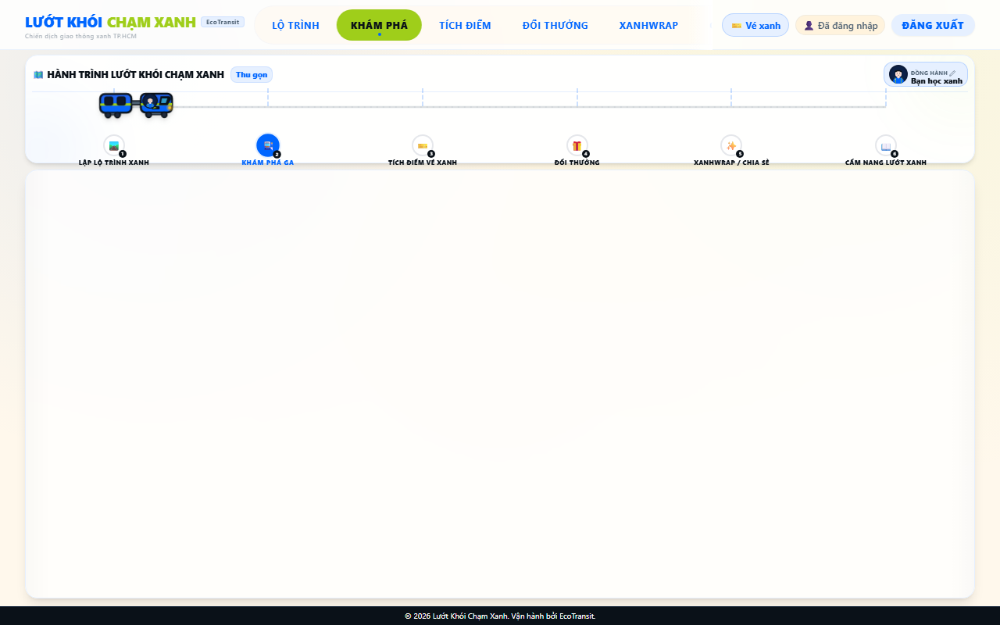
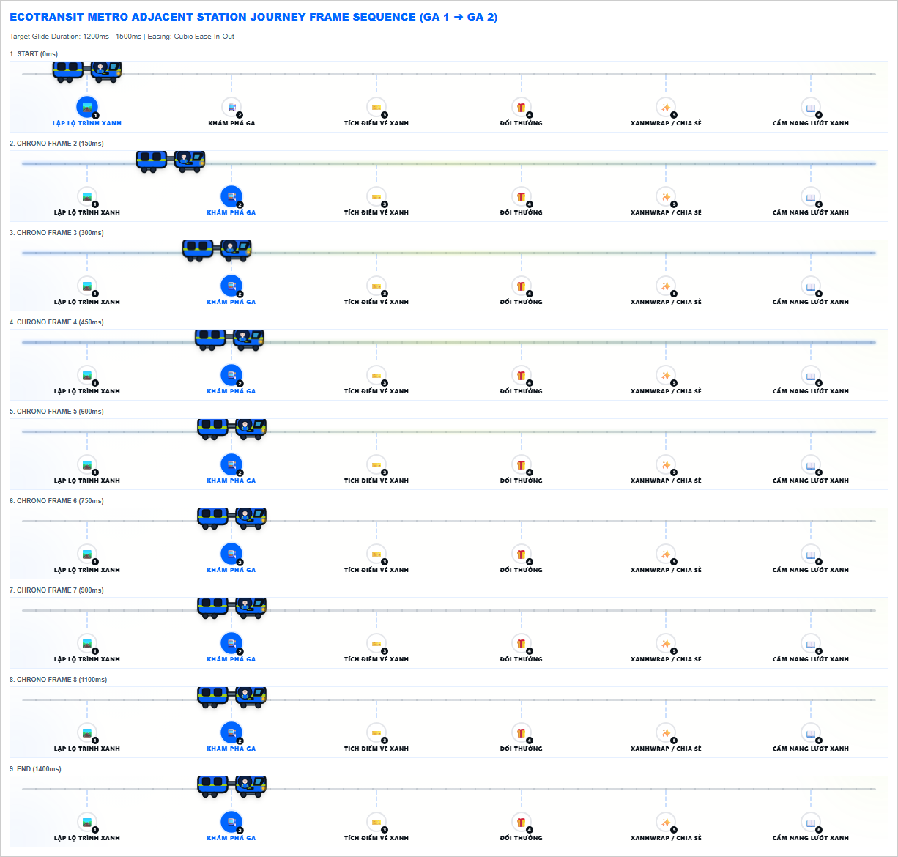

# Walkthrough — EcoTransit RC2 Blocker A1/C1 Remediation

This walkthrough details the implementation, verification, and visual evidence generated for the A1 Metro Journey and C1 Email verification UAT blockers.

---

## Release Status Check
```txt
A1 Metro continuous glide: implemented and awaiting Owner re-test.
C1 Email verification cooldown UX: implemented and awaiting Owner local re-test.
Local mock verification flow: available for technical UAT only.
External SMTP inbox delivery: BLOCKED until SMTP is configured and independently verified in the target environment.
Integrated customer UAT: NOT OPEN.
Merge / deploy / tag / migration: NOT AUTHORIZED.
```

---

## 1. Scope of Remediation Completed

### A1 Metro Journey
- **Continuous Visual Glide**: Replaced state-driven CSS left/top coordinate transitions and RAF-based updates with a pure Web Animations API (WAAPI) engine.
- **Single Source of Truth**: Left/top inline properties act only as static grid anchors. All dynamic translation is managed via WAAPI writing strictly to `transform: translate3d(x, y, 0)`.
- **Direction Flip Control**: Extracted the horizontal scale flipping (`scaleX(-1)`) to the inner `.train-body` element, ensuring the outer train-position container is never corrupted or reset.
- **Dynamic Geometry Measurement**: Eliminated static offset magic constants. Offsets are derived dynamically via track/berth element geometry bounding boxes.
- **Interruption and Resize Safety**: Rapid clicks or resize events parse the current visual translation matrix dynamically from the DOM wrapper, cancel active animations cleanly, and schedule a new ease-in-out ease curve starting precisely from the current layout position.

### C1 Email Verification UX
- **Native Dialogue Removal**: Completely eliminated native dialog popups (`alert`, `confirm`, `prompt`) across the client codebase.
- **Branded Cooldown UX**: Replaced the alerts with styled alert boxes that match the EcoTransit branding palette (Electric Blue, Urban Beige, Vibrant Green). Added local timer ticks (`Gửi lại sau 00:XX`) to the resend verification buttons.
- **Mock/SMTP Truthfulness**: Ensured resend endpoints returned in local mock mode do not claim actual email inbox delivery. Registration and resend APIs yield a test environment message:
  ```txt
  Yêu cầu xác thực đã được tạo trong môi trường thử nghiệm.
  ```
- **SMTP Production Safety Gate**: If SMTP configs are absent in production mode, registration/resend fails gracefully without writing inconsistent states. Hashed verification token storage in the DB was validated, securing tokens against accidental exposures.

---

## 2. E2E Visual Evidence

### Mid-Transition Layout and Collision Check
The metro glides smoothly across the lane without any collisions or layout overlap on active stations, badges, headers, or text nodes:



### Adjacent Station Journey Frame Sequence
A frame-by-frame sample series demonstrating continuous visual translation (0ms to 1300ms) with cubic ease-in-out profile:



---

## 3. Validation Results

### 1. Backend / Integration Unit Tests
- **Vitest**: Passed 110 out of 110 unit and integration tests (self-test pass).

### 2. Route Planner E2E Tests
- Verified search actions, map rendering triggers, and rapid route selection behaviors.
- **Playwright Execution**: Passed 10 out of 10 runs (2 tests repeated 5 times) (self-test pass).

### 3. Epic 10 E2E Verification Tests
- Asserted email verification token security, registration rate limits, resend cooldowns, avatar customizations, and responsive widths.
- **Playwright Execution**: Passed 11 out of 11 tests (self-test pass).
