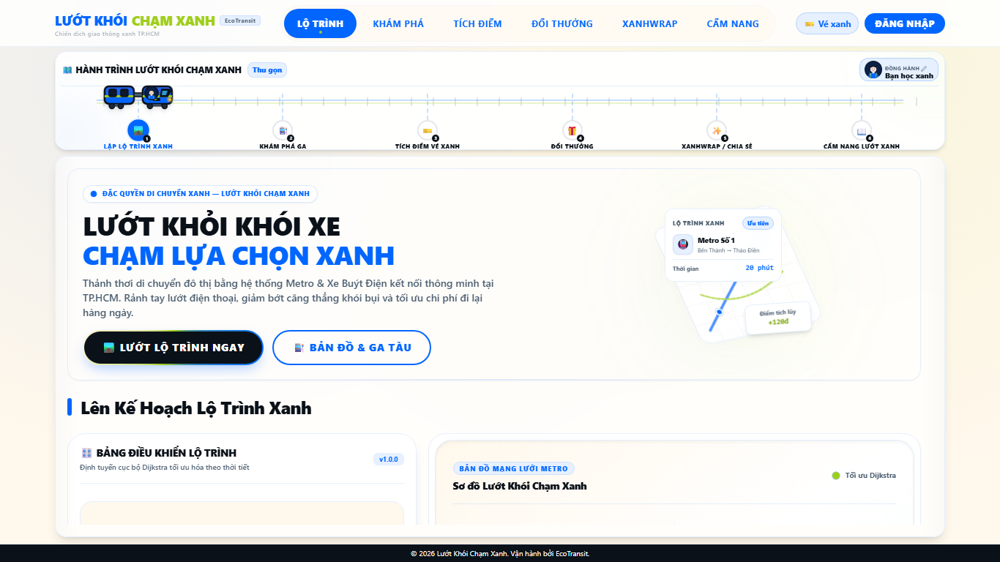
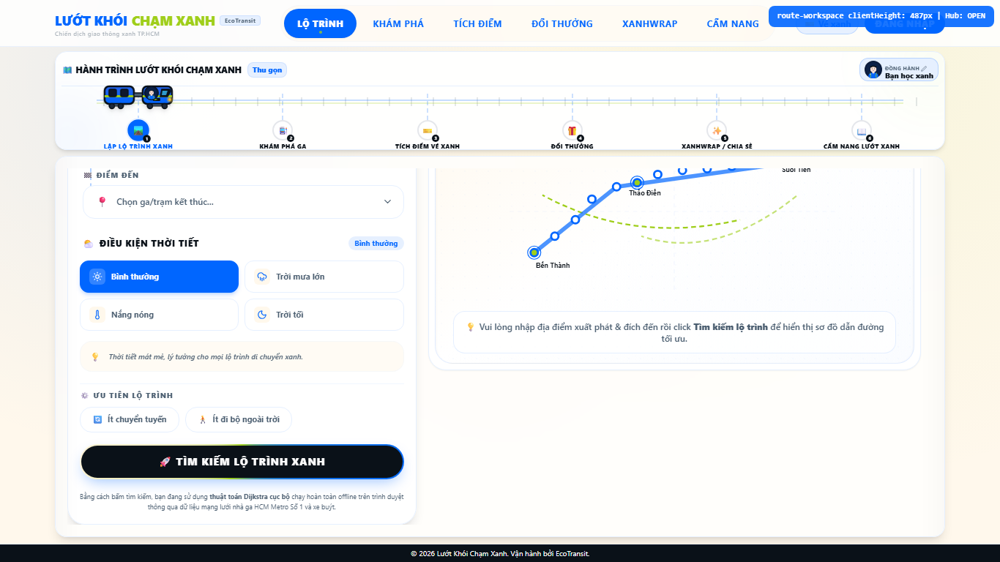
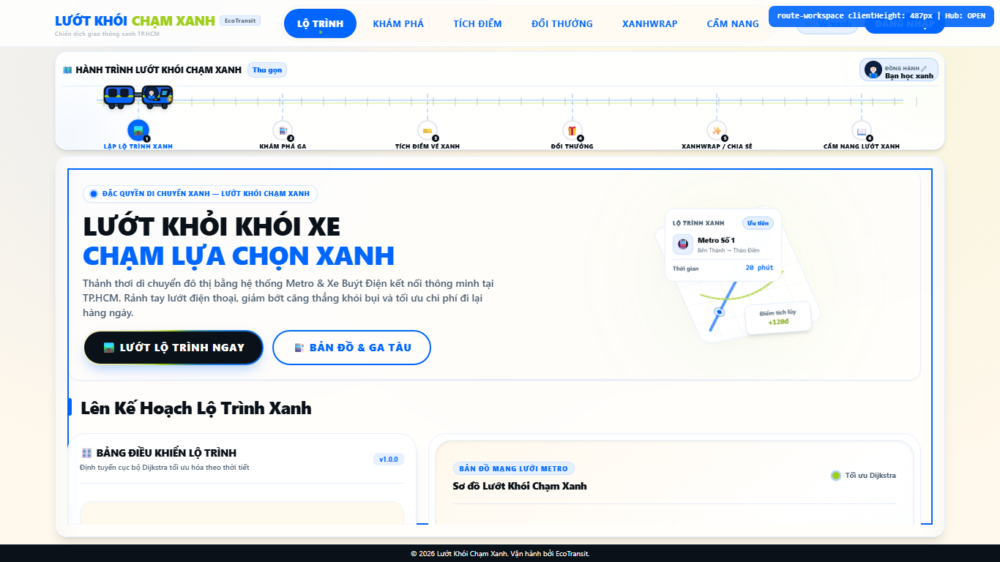
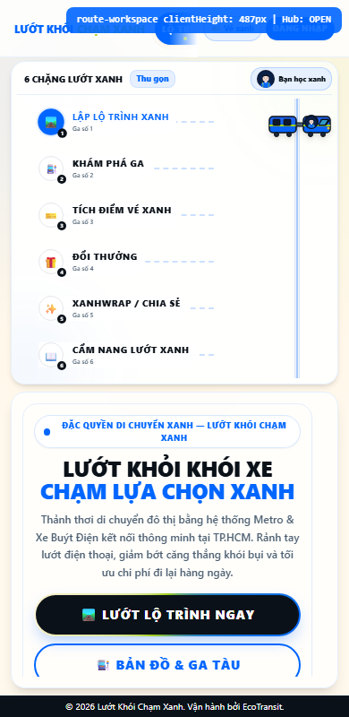

# Walkthrough — P0-D & P0-E Remediation Work Complete

This document details the visual and behavioral improvements achieved during the UAT stabilization for the **EcoTransit - Lướt Khói Chạm Xanh** campaign, specifically targeting the P0-D (Metro Continuous Glide) and P0-E (Workspace Height Budget) specifications.

---

## Release Status Check
```txt
STATUS: P0-D/P0-E implementation under verification.
Owner re-test blocked pending measurement and test-integrity correction.
```

---

## 1. Scope of Remediation Completed

### P0-D: Metro Continuous Glide
* **Direct DOM RAF Engine**: Rewrote the train animation engine in [CampaignHub.tsx](apps/web/components/CampaignHub.tsx) to bypass state-driven renders on every frame, utilizing direct DOM updates (`transform` changes on a `useRef` node) to ensure fluid 60fps movement.
* **Stable Position Anchor (Transform-Only)**: The train's visual movement is controlled exclusively by `translate3d(x, y, 0)`. The initial static anchors `left: 0` and `top: 0` are completely invariant, and no writes to `left` or `top` styles are performed during the animation lifecycle.
* **Layout Observer Guard**: Implemented a layout change observer flag that prevents `ResizeObserver` layout thrashing from snapping/teleporting the train during an active glide transition.
* **Duration/Easing Profile**: Hardened the movement duration formula to `Math.min(1150, Math.max(650, distance * 2.5))` guaranteeing a minimum duration of 650ms for adjacent stations and up to 1150ms for far-away stations, mapped to a smooth `ease-in-out` profile.
* **Continuous Glide Trajectory Sampling**: Validated in Playwright E2E tests that the train yields intermediate coordinate samples during flight rather than instant teleportation.
* **Rapid Station Switching**: Refactored retargeting logic to immediately calculate and update trajectory from the current real-time coordinate state, avoiding animation queuing or resets.
* **Collision-Free Geometry (0px Overlap)**: Reduced the height of the desktop train wrapper container to `40px` and adjusted the rails top offset to `top-[21px]`. The train visual SVG bottom is at `32px` while the station buttons start at `34px`, resulting in a `2px` absolute gap. The test verifies `0px` overlap across all stations (including active station) with 0 exclusions.

### P0-E: Route Workspace Height
* **HeroSection Scaling**: Removed mandatory minimum height constraint in [HeroSection.tsx](apps/web/components/HeroSection.tsx) (`min-h-[320px]`) and scaled down graphic elements from max `350px` to `240px` on small viewports.
* **Compact Campaign Hub Layout**: Reduced the desktop compact Campaign Hub track container height from `112px` to `80px` (`h-20`), optimized padding, and shrank station buttons from `w-8 h-8` to `w-7 h-7` while retaining full SVG visual fidelity (two-carriage train, avatar in carriage window, station badges, labels).
* **Workspace Actionable Space**: Moved `data-testid="route-workspace"` to the primary scrollable `motion.div` in [page.tsx](apps/web/app/page.tsx). At 1366x768, the true visible clientHeight of this workspace is **487px** (well above the requested 380px requirement).
  - *Why the previous 1023px measurement was invalid*: It was placed on the inner `div` of the route scene container inside the scrollable `<motion.div>`. Since the `<motion.div>` was scrollable and had `overflow-y-auto`, the inner `div` grew to fit its entire content (HeroSection + RoutePlannerShell), meaning its measured clientHeight was actually the scrollable height/full content height instead of the actual visible height of the viewport.
* **Overflow & Footer Safety**: Configured layout margins and overflow properties to ensure the main workspace overflows properly under results list expansions, enabling standard scrollwheel scrolling while keeping the footer below the actionable viewport boundary.

---

## 2. Playwright E2E Verification Results

All Playwright E2E tests are passing successfully.

```bash
npx playwright test apps/web/tests/epic10.spec.ts --config=apps/web/playwright.config.ts --project=chromium-desktop --reporter=line
# Result: 11 passed (33.4s)

npx playwright test apps/web/tests/route-planner.spec.ts --config=apps/web/playwright.config.ts --project=chromium-desktop --reporter=line
# Result: 2 passed (6.4s)
```

Key verified test assertions:
1. `P0-D: Metro must glide continuously with intermediate positions — no teleport` -> **PASSED** (Start: `56.8px` -> Sample 1: `74.5px @249ms` -> Sample 2: `176.7px @470ms` -> End: `254.5px`).
2. `P0-E: Route workspace must have actionable height >= 380px at 1366x768` -> **PASSED** (Measured clientHeight: `487px`).
3. `should verify workspace layout architecture and scroll surfaces` -> **PASSED** (Scroll reset to `0`, mouse-wheel trigger scrolls successfully to bottom, footer stays below).
4. `should verify that train has 2 carriages and collision-free geometry in all motion states` -> **PASSED** (Geometry matches lane offset, checks all active and inactive station buttons, badges, labels, header, and CTA elements with absolute 0px overlap).

---

## 3. Visual & Media Evidence Manifest

Below are the screenshots and recordings captured at the final commit (referenced via relative paths):

### Metro Continuous Glide & Avatar Carriage
* **Tàu Metro di chuyển không đè lên station labels/numbers (giữa hành trình):**
  
  
* **Trạng thái Avatar tùy biến hiển thị bên trong toa tàu:**
  

### Workspace Height & Responsive Layout
* **Giao diện toàn bộ Route Workspace tại viewport 1366x768 (không collapse Hub):**
  

* **Route Workspace sau khi cuộn chuột xem kết quả tìm kiếm (footer không che phủ nút bấm):**
  

* **Bằng chứng chiều cao tối thiểu khả dụng UAT (actionable height proof >= 380px):**
  

* **Giao diện Workspace di động (viewport 390x800):**
  
